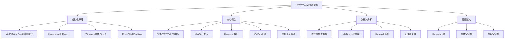
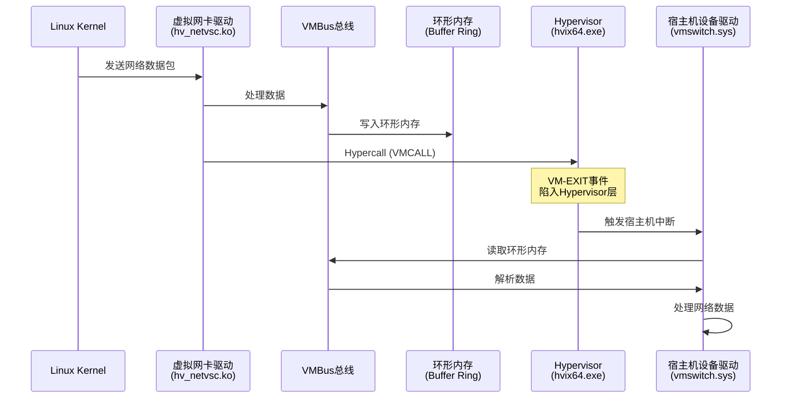
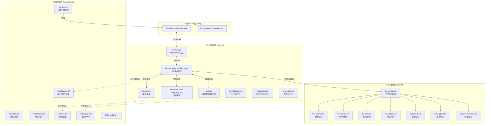

# LLM分析 1.md

## 0. 基础信息

```
文章标题：[原创]Hyper-V安全从0到1(1)
作者/来源：看雪安全社区 / ID: ifyou
发布时间：2017-11-8
分析时间：2026-04-26
技术领域标签：Hyper-V虚拟化、Intel VT/AMD-V、VMBus、Hypercall、虚拟设备驱动
原文链接：https://bbs.kanxue.com/thread-222626-1.htm
```

---

## 1. 总体摘要

**第1段（Hyper-V虚拟化原理）**：介绍Hyper-V使用Intel VT或AMD-V硬件虚拟化技术作为核心，Hypervisor层（Ring -1）在Windows内核（Ring 0）之前初始化，宿主机（Root Partition）和虚拟机（Child Partition）运行在同一权限级别。

**第2段（关键概念解释）**：解释VM-EXIT/VM-ENTRY、VMCALL指令、Hypercall接口、VMBus总线、虚拟设备驱动等核心概念，说明宿主机与虚拟机通过VMCALL指令和VMBus进行通信。

**第3段（数据流示例）**：以Linux虚拟机发送网络数据包为例，展示数据从虚拟机内核→虚拟设备驱动→VMBus→环形内存→Hypercall→Hypervisor→宿主机中断→VMBus→宿主机设备驱动的完整流程。

**第4段（安全风险分析）**：指出Hyper-V将主要模块放在宿主机Ring 0权限下运行的特性带来的安全风险，虚拟机可通过问题驱动影响宿主机稳定性，同时增加了安全审计难度。

**第5段（组件介绍）**：系统整理Hyper-V三层架构（Hypervisor层、内核空间层、应用空间层）的核心组件文件、功能及对应的Linux虚拟机驱动。

**总结**：该文章是Hyper-V安全研究系列的开篇，从虚拟化原理、核心概念、数据流向、安全风险到组件架构，全面介绍了Hyper-V的基础知识。文章以Intel VT/AMD-V硬件虚拟化技术为根基，详细阐述了Hypervisor层（Ring -1）与Windows内核（Ring 0）的关系，解释了VM-EXIT/VM-ENTRY、Hypercall、VMBus等关键机制，并通过网络数据包传输示例展示了宿主机与虚拟机之间的通信流程。最后系统整理了Hyper-V三层架构的核心组件，为后续漏洞研究奠定基础。



---

## 2. 分段详解

### 2. Hyper-V的结构

#### 2.1 Hyper-V虚拟化原理和实现方式

本段讲述了Hyper-V虚拟化的核心实现机制。实现过程使用了Intel VT-x/AMD-V硬件虚拟化技术，利用了CPU虚拟化扩展指令集，同时还需要满足宿主机支持硬件虚拟化、系统启动时先初始化Hypervisor层、Windows内核后初始化的前置条件。

**核心架构**：

| 层级 | 名称 | 权限级别 | 实现文件 | 说明 |
|------|------|----------|----------|------|
| Hypervisor层 | Hypervisor | Ring -1 | hvix64.exe (Intel)<br>hvax64.exe (AMD) | 最高权限，管理虚拟化 |
| 宿主机内核 | Root Partition | Ring 0 | ntoskrnl.exe | Windows内核 |
| 虚拟机内核 | Child Partition | Ring 0 | 各Guest OS内核 | 与宿主机同级权限 |

**启动流程**：
1. 系统启动时先运行`hvix64.exe`或`hvax64.exe`初始化Hypervisor层
2. 然后运行Windows内核`ntoskrnl.exe`进行系统初始化
3. Hypervisor层代码级别高于Windows内核（Ring -1 vs Ring 0）

**关键特性**：
- 宿主机（Root Partition）和虚拟机（Child Partition）运行在同一权限级别（Ring 0）
- 宿主机拥有管理虚拟机状态的权限（开关机、设备管理等）
- 底层代码运行级别相同，但宿主机有管理权限

**Intel VT核心概念**（LLM补充：基于Intel VT-x技术规范）：

| 术语 | 英文全称 | 说明 |
|------|----------|------|
| VM-EXIT | Virtual Machine Exit | 从VMX non-root operation切换到VMX root operation，即虚拟机/宿主机代码切换到Hypervisor层代码 |
| VM-ENTRY | Virtual Machine Entry | 从VMX root operation切换到VMX non-root operation，即Hypervisor层返回到虚拟机/宿主机代码 |
| VMCALL | Virtual Machine Call | 在虚拟机/宿主机中执行VMCALL指令引发VM-EXIT事件，陷入Hypervisor层处理，类似于系统调用的SYSCALL指令 |

**Hypercall机制**：
- Hyper-V中的Hypercall与XEN中的Hypercall类似
- 用于和Hypervisor层进行交互的接口
- 调用VMCALL指令进入Hypervisor层代码
- 类似于系统调用SYSCALL指令，用于调用Hypervisor中的例程

**VMBus总线**：
- Hyper-V抽象出来用于数据传输的通信信道
- 起着虚拟机和宿主机之间的信息交流作用
- 所有虚拟设备的数据全部由VMBus总线进行处理和分发
- 每个虚拟设备分配自己的Channel
- 每个Channel对应一个环形内存结构（Ring Buffer）
- 只有当环形内存读满一圈或写满才会通知对方继续发送或接收数据

**虚拟设备驱动**：
- 与QEMU模拟硬件端口不同，Hyper-V全部使用虚拟设备
- 不再使用传统的读写模拟硬件端口方式
- 虚拟机中网卡、硬盘等设备的驱动由微软提供
- 类似于QEMU中的VIRTIO设备，需要加载特殊驱动
- 虚拟设备由VMBus总线和宿主机通信
- 优势：更高效率、更好利用硬件资源

**数据流示例**（Linux虚拟机发送网络数据包）：



**安全风险**：
- 虚拟机和宿主机运行在同一权限级别
- 虚拟机可发送数据到宿主机驱动
- 宿主机驱动解析数据时若存在问题（如越界读），会导致宿主机蓝屏等严重后果
- 主要模块放在宿主机Ring 0权限下运行，增加了安全审计难度

---

#### 2.2 Hyper-V组件及组件功能

本段讲述了Hyper-V三层架构的核心组件及其功能。实现过程使用了系统文件分类整理的方式，利用了组件功能映射的方法，同时还需要满足以Linux虚拟机为例进行对应说明的前置条件。

**Hypervisor层**（表1-1）：

| 文件名称 | 文件位置 | 功能 | 虚拟机对应设备 |
|----------|----------|------|----------------|
| hvix64.exe | C:\Windows\System32 | Intel CPU的Hypervisor层逻辑，Ring -1层，负责Hyper-V虚拟化 | 无 |
| hvax64.exe | C:\Windows\System32 | AMD CPU的Hypervisor层逻辑 | 无 |
| hvloader.exe<br>hvloader.efi | C:\Windows\System32 | 系统启动时初始化Hypervisor | 无 |

**内核空间层**（表1-2）：

| 文件名称 | 文件位置 | 功能 | 虚拟机对应设备 |
|----------|----------|------|----------------|
| vmbusr.sys<br>vmbkmclr.sys | C:\Windows\System32\drivers | VMBus总线驱动 | hv_vmbus.ko |
| winhvr.sys | C:\Windows\System32\drivers | Hypervisor层与宿主机交互，初始化Hypercall<br>类似Linux中./drivers/hv/hv.c | hv_vmbus.ko |
| storvsp.sys | C:\Windows\System32\drivers | 虚拟硬盘设备 | hv_storvsc.ko |
| vmswitch.sys<br>vmsproxy.sys | C:\Windows\System32\drivers | 虚拟网络交换机设备（网卡） | hv_netvsc.ko |
| vid.sys | C:\Windows\System32\drivers | 虚拟化基础设施（Virtualization Infrastructure） | 无 |
| synth3dvsp.sys | C:\Windows\System32\drivers | RemoteFX显示加速 | 无 |
| hvsocket.sys | C:\Windows\System32\drivers | Hyper-V Socket Provider | 无 |
| hvservice.sys | C:\Windows\System32\drivers | Hypervisor Boot Driver | 无 |

**应用空间层**（表1-3）：

| 文件名称 | 文件位置 | 功能 | 虚拟机对应设备 |
|----------|----------|------|----------------|
| vmwp.exe | C:\Windows\System32 | 虚拟机工作进程（VM Worker Process） | 无 |
| vmuidevices.dll | C:\Windows\System32 | 虚拟显示器、键盘、鼠标 | hyperv_fb.ko（显示）<br>hid_hyperv.ko（鼠标）<br>hyperv_keyboard.ko |
| vmicvdev.dll | C:\Windows\System32 | 虚拟机集成服务（Integration Services） | hv_utils.ko |
| vmdynmem.dll | C:\Windows\System32 | 虚拟机动态内存设备 | hv_balloon.ko |
| vmbuspiper.dll | C:\Windows\System32 | 用户态的VMBus总线设备 | 无 |
| vid.dll | C:\Windows\System32 | 用户态的Hyper-V虚拟化基础设施 | 无 |
| virtdisk.dll | C:\Windows\System32 | 虚拟硬盘 | 无 |
| vmsynthfcvdev.dll | C:\Windows\System32 | 虚拟光纤通道适配器 | 无 |
| vmsynthstor.dll | C:\Windows\System32 | 虚拟存储器适配器 | 无 |
| vmsif.dll | C:\Windows\System32 | 虚拟交换机接口 | 无 |
| vmchipset.dll | C:\Windows\System32 | 虚拟BIOS | 无 |
| vmsynth3dvideo.dll | C:\Windows\System32 | 虚拟3D显示设备 | 无 |
| VmSynthNic.dll | C:\Windows\System32 | 虚拟网卡 | 无 |
| vmicrdv.dll | C:\Windows\System32 | 远程虚拟桌面 | 无 |
| vmwpctrl.dll | C:\Windows\System32 | 虚拟机控制模块 | 无 |
| vsconfig.dll | C:\Windows\System32 | 虚拟机配置模块 | 无 |
| vmprox.dll | C:\Windows\System32 | Hyper-V Component Proxy | 无 |
| rdp4vs.dll | C:\Windows\System32 | Virtual Machine Remoting Services API | 无 |
| vmrdvcore.dll | C:\Windows\System32 | VmRdvCore Endpoint | 无 |
| vmsmb.dll | C:\Windows\System32 | 虚拟SMB设备 | 无 |

**组件架构图**：



---

## 3. 技术要点总结

| 类别 | 关键内容 |
|------|----------|
| **虚拟化技术** | Intel VT-x / AMD-V硬件虚拟化 |
| **权限层级** | Hypervisor (Ring -1) > Windows内核/虚拟机 (Ring 0) |
| **核心机制** | VM-EXIT/VM-ENTRY、VMCALL、Hypercall、VMBus |
| **通信方式** | 环形内存（Ring Buffer）+ Hypercall通知 |
| **设备模型** | 虚拟设备（非硬件模拟），需特殊驱动 |
| **安全风险** | 宿主机驱动在Ring 0运行，虚拟机可影响宿主机稳定性 |
| **三层架构** | Hypervisor层 → 内核空间层 → 应用空间层 |

## 4. 关键术语表

| 术语 | 说明 |
|------|------|
| Root Partition | 宿主机分区，拥有管理虚拟机权限 |
| Child Partition | 虚拟机分区，与宿主机同级权限运行 |
| VM-EXIT | 从虚拟机/宿主机切换到Hypervisor层 |
| VM-ENTRY | 从Hypervisor层返回到虚拟机/宿主机 |
| VMCALL | 触发VM-EXIT的指令，类似系统调用 |
| Hypercall | Hyper-V的Hypervisor调用接口 |
| VMBus | Hyper-V虚拟总线，用于数据传输 |
| Channel | VMBus上的通信通道，对应环形内存 |
| Ring Buffer | 环形内存结构，用于数据缓冲 |
| hvix64.exe | Intel CPU的Hypervisor实现 |
| hvax64.exe | AMD CPU的Hypervisor实现 |
| vmswitch.sys | 虚拟网络交换机驱动（后续漏洞分析重点） |
