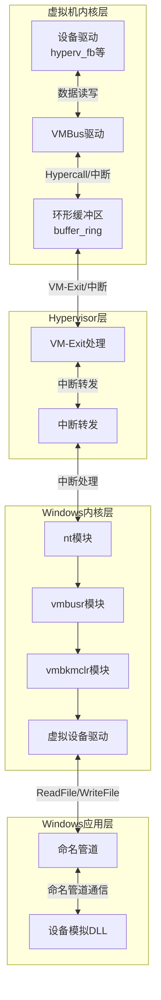
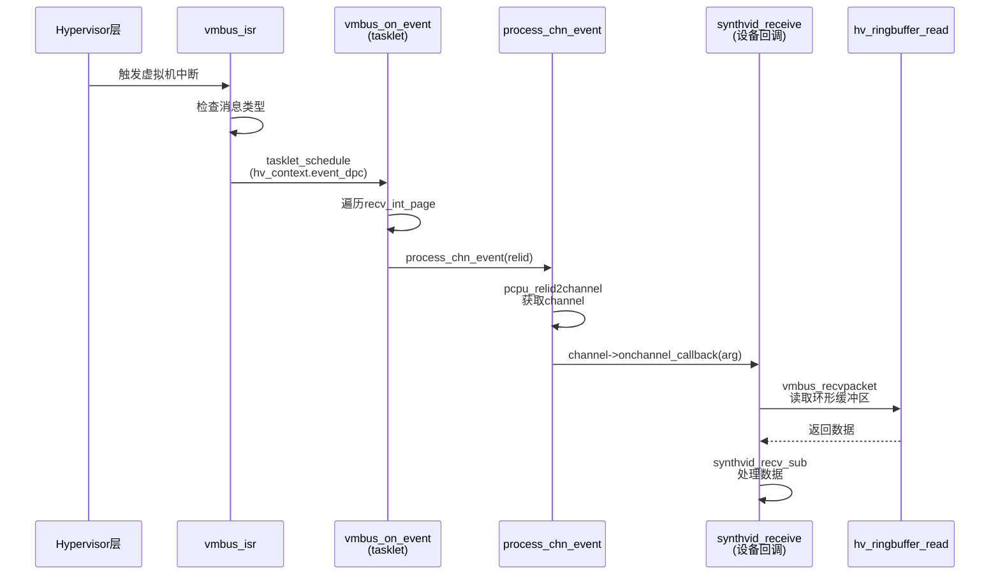
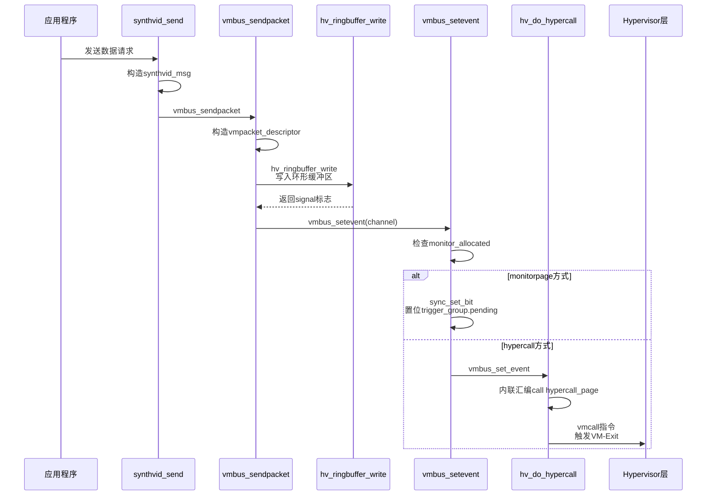
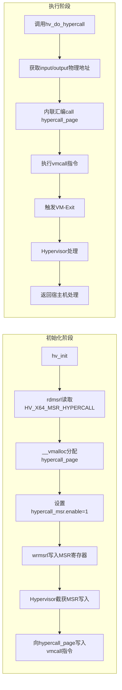

## 文章总结：Hyper-V安全从0到1(3)

### 基础信息

```
文章标题：Hyper-V安全从0到1(3)
作者/来源：看雪安全社区 / ifyou
发布时间：2017-11-9
分析时间：2026-04-26
技术领域标签：Hyper-V虚拟化、VMBus、数据传输、Linux内核驱动、Hypercall、VM-Exit
原文链接：https://bbs.kanxue.com/thread-222656.htm
```

---

### 总体摘要

**第1段（引言）**：本文聚焦Hyper-V虚拟机与宿主机之间的数据传输机制，强调这是Hyper-V安全研究的核心部分。理解数据传输方法和流程有助于识别攻击面、分析函数功能和结构体成员分布，为逆向工程和漏洞复现提供基础。

**第2段（数据传输流程概览）**：数据流向分为四个层次：虚拟机内核层→Hypervisor层→Windows内核层→Windows应用层。数据通过环形内存(buffer_ring)传输，经由VMBus调用Hypercall通知Hypervisor层。Hypervisor处理VM-Exit事件，Windows内核通过中断接收数据并分发到相应模块，用户态通过命名管道与内核通信。

**第3段（虚拟机接收数据流程）**：以Linux内核4.7.2的hyperv_fb驱动为例，详细追踪了从Hypervisor触发中断到最终调用设备特定回调函数的完整调用链，涉及中断注册、tasklet软中断处理、channel事件分发等机制。

**第4段（虚拟机发送数据流程）**：数据通过vmbus_sendpacket写入环形缓冲区，然后通过vmbus_setevent通知宿主机。通知方式分为monitorpage置位和hypercall两种，不同设备类型使用不同方式。

**第5段（monitorpage通知方式）**：通过共享内存页的trigger_group.pending置位实现轻量级通知，适用于网卡和硬盘设备。初始化过程在vmbus_connect函数中完成。

**第6段（hypercall通知方式）**：通过hv_do_hypercall函数执行vmcall汇编指令触发VM-Exit事件，陷入Hypervisor层处理。hypercall_page通过MSR寄存器初始化，包含vmcall指令序列。

**总结**：该文章从安全研究视角出发，以Linux内核代码为分析对象，系统性地剖析了Hyper-V虚拟机与宿主机之间的数据传输机制。文章采用代码追踪的方法，从hyperv_fb驱动入手，逐层深入中断处理、VMBus通信、Hypercall实现等核心技术细节，最终揭示了虚拟化通信的底层实现原理，为Hyper-V漏洞挖掘提供了理论基础。

---

### 技术流程图

#### 1. 数据流向架构图



#### 2. 虚拟机接收数据流程图



#### 3. 虚拟机发送数据流程图



#### 4. Hypercall初始化与执行流程



---

### 分段详解

#### 4.1 数据传输流程概览

本段讲述了Hyper-V整体数据传输框架的实现机制。实现过程使用了**分层架构**方式，利用了**VMBus虚拟总线**的**环形缓冲区通信机制**，同时还需要满足**Hypervisor层的中断转发**、**Windows内核层的中断分发**、**用户态的命名管道通信**。

**核心逻辑的实现过程是**：

| 数据方向 | 流程步骤 |
|---------|---------|
| 虚拟机→宿主机 | 1. 数据填入`buffer_ring`<br/>2. VMBus调用Hypercall<br/>3. Hypervisor触发VM-Exit<br/>4. 宿主机处理数据 |
| 宿主机→虚拟机 | 1. 宿主机写入`buffer_ring`<br/>2. Hypervisor触发虚拟机中断<br/>3. 中断处理程序调用回调函数<br/>4. 虚拟机读取并解析数据 |

**Windows内核层数据分发**：
- `nt`模块接收Hypervisor层中断数据
- 分发到`vmbusr`模块
- 根据数据类型分发到`vmbkmclr`模块
- `vmbkmclr`分发到相应虚拟设备驱动或通知用户态程序

**Windows应用层通信**：
- 用户态DLL模拟显示、鼠标键盘、动态内存、集成服务等设备
- 通过`WriteFile`/`ReadFile`读写命名管道与内核通信

---

#### 4.2 虚拟机操作系统层

本段讲述了Linux虚拟机内核中数据收发的完整实现机制。实现过程使用了**中断驱动+回调函数**方式，利用了**Linux内核VMBus驱动框架**的**tasklet软中断处理机制**，同时还需要满足**中断向量注册**、**channel初始化**、**环形缓冲区读写**。

**技术环境**：Linux内核版本4.7.2，分析对象`hyperv_fb`（虚拟显示设备）驱动，源文件位置`./linux-4.7.2/drivers/video/fbdev/hyperv_fb.c`

##### 从宿主机接收数据

**中断注册流程**：

```c
// 1. VMBus总线初始化时注册中断处理函数
static int vmbus_bus_init(void)
{
    ......
    hv_setup_vmbus_irq(vmbus_isr);  // 注册中断处理函数
    ......
}

// 2. 设置中断向量和处理函数
void hv_setup_vmbus_irq(void (*handler)(void))
{
    vmbus_handler = handler;  // handler指向vmbus_isr
    if (!test_bit(HYPERVISOR_CALLBACK_VECTOR, used_vectors))
        alloc_intr_gate(HYPERVISOR_CALLBACK_VECTOR, hyperv_callback_vector);
}

// 3. 中断处理函数入口（arch/x86/entry/entry_64.S）
apicinterrupt3 HYPERVISOR_CALLBACK_VECTOR \
    hyperv_callback_vector hyperv_vector_handler

// 4. 中断处理函数实现
void hyperv_vector_handler(struct pt_regs *regs)
{
    entering_irq();
    if (vmbus_handler)
        vmbus_handler();  // 调用vmbus_isr
    exiting_irq();
}
```

**回调函数注册流程**：

```c
// 驱动初始化时注册回调函数
static int synthvid_connect_vsp(struct hv_device *hdev)
{
    // 注册接收数据时的回调函数synthvid_receive
    ret = vmbus_open(hdev->channel, RING_BUFSIZE, RING_BUFSIZE,
                     NULL, 0, synthvid_receive, hdev);
    ......
}

// vmbus_open将回调函数存入channel结构
int vmbus_open(struct vmbus_channel *newchannel, ...)
{
    ......
    newchannel->onchannel_callback = onchannelcallback;  // 存储回调函数指针
    newchannel->channel_callback_context = context;
    ......
}
```

**tasklet初始化与调用链**：

```c
// hv_synic_alloc中初始化tasklet
int hv_synic_alloc(void)
{
    for_each_online_cpu(cpu) {
        // 分配并初始化event_dpc tasklet
        hv_context.event_dpc[cpu] = kmalloc(size, GFP_ATOMIC);
        tasklet_init(hv_context.event_dpc[cpu], vmbus_on_event, cpu);
        
        // 分配并初始化msg_dpc tasklet
        hv_context.msg_dpc[cpu] = kmalloc(size, GFP_ATOMIC);
        tasklet_init(hv_context.msg_dpc[cpu], vmbus_on_msg_dpc, cpu);
        ......
    }
}
```

**完整数据接收调用链**：

```
Hypervisor触发中断
    ↓
vmbus_isr() [中断处理函数]
    ↓
tasklet_schedule(hv_context.event_dpc[cpu]) [调度软中断]
    ↓
vmbus_on_event() [tasklet处理函数]
    ↓
process_chn_event(relid) [处理channel事件]
    ↓
channel->onchannel_callback(arg) [调用设备特定回调]
    ↓
synthvid_receive() [hyperv_fb驱动回调]
    ↓
vmbus_recvpacket() [接收数据包]
    ↓
hv_ringbuffer_read() [从环形缓冲区读取]
```

**关键代码解析**：

```c
// vmbus_on_event：遍历中断页，处理所有待处理事件
void vmbus_on_event(unsigned long data)
{
    for (dword = 0; dword < maxdword; dword++) {
        if (!recv_int_page[dword])
            continue;
        for (bit = 0; bit < 32; bit++) {
            if (sync_test_and_clear_bit(bit, &recv_int_page[dword])) {
                relid = (dword << 5) + bit;
                process_chn_event(relid);  // 处理每个channel的事件
            }
        }
    }
}

// process_chn_event：根据relid找到channel并调用回调
static void process_chn_event(u32 relid)
{
    channel = pcpu_relid2channel(relid);  // 根据relid获取channel
    if (channel->onchannel_callback != NULL) {
        arg = channel->channel_callback_context;
        channel->onchannel_callback(arg);  // 调用设备回调函数
    }
}

// synthvid_receive：hyperv_fb驱动的数据接收函数
static void synthvid_receive(void *ctx)
{
    do {
        ret = vmbus_recvpacket(hdev->channel, recv_buf,
                               MAX_VMBUS_PKT_SIZE, &bytes_recvd, &req_id);
        if (bytes_recvd > 0 && recv_buf->pipe_hdr.type == PIPE_MSG_DATA)
            synthvid_recv_sub(hdev);  // 处理接收到的数据
    } while (bytes_recvd > 0 && ret == 0);
}

// __vmbus_recvpacket：从环形缓冲区读取数据
static inline int __vmbus_recvpacket(struct vmbus_channel *channel, ...)
{
    ret = hv_ringbuffer_read(&channel->inbound, buffer, bufferlen,
                             buffer_actual_len, requestid, &signal, raw);
    if (signal)
        vmbus_setevent(channel);  // 通知宿主机读取完成
    return ret;
}
```

##### 发送数据至宿主机

**数据发送流程**：

```c
// synthvid_send：构造并发送数据包
static inline int synthvid_send(struct hv_device *hdev, struct synthvid_msg *msg)
{
    msg->pipe_hdr.type = PIPE_MSG_DATA;
    msg->pipe_hdr.size = msg->vid_hdr.size;
    // 发送数据包到宿主机
    ret = vmbus_sendpacket(hdev->channel, msg,
                           msg->vid_hdr.size + sizeof(struct pipe_msg_hdr),
                           atomic64_inc_return(&request_id),
                           VM_PKT_DATA_INBAND, 0);
    return ret;
}

// vmbus_sendpacket_ctl：控制数据包发送
int vmbus_sendpacket_ctl(struct vmbus_channel *channel, void *buffer, ...)
{
    // 构造vmpacket_descriptor描述符
    desc.type = type;
    desc.flags = flags;
    desc.offset8 = sizeof(struct vmpacket_descriptor) >> 3;
    desc.len8 = (u16)(packetlen_aligned >> 3);
    desc.trans_id = requestid;
    
    // 构造bufferlist
    bufferlist[0].iov_base = &desc;
    bufferlist[1].iov_base = buffer;
    bufferlist[2].iov_base = &aligned_data;
    
    // 写入环形缓冲区
    ret = hv_ringbuffer_write(&channel->outbound, bufferlist, num_vecs,
                              &signal, lock);
    // 通知宿主机
    if (((ret == 0) && kick_q && signal) || ...)
        vmbus_setevent(channel);
    return ret;
}
```

**通知宿主机的两种方式**：

| 方式 | 适用设备 | 实现机制 |
|------|---------|---------|
| monitorpage | 网卡(hv_netvsc)、硬盘(hv_storvsc) | 共享内存置位 |
| hypercall | 集成服务(hv_utils)、键盘(hyperv_keyboard)、鼠标(hid_hyperv)、动态内存(hv_balloon)、视频(hyperv_fb) | vmcall指令 |

**1. monitorpage方式**：

```c
static void vmbus_setevent(struct vmbus_channel *channel)
{
    if (channel->offermsg.monitor_allocated) {
        // 在send_int_page置位
        sync_set_bit(channel->offermsg.child_relid & 31,
                     (unsigned long *)vmbus_connection.send_int_page +
                     (channel->offermsg.child_relid >> 5));
        
        // 在monitorpage的trigger_group.pending置位
        monitorpage = vmbus_connection.monitor_pages[1];
        sync_set_bit(channel->monitor_bit,
                     (unsigned long *)&monitorpage->trigger_group
                     [channel->monitor_grp].pending);
    } else {
        vmbus_set_event(channel);  // 使用hypercall方式
    }
}
```

monitorpage初始化过程：

```c
int vmbus_connect(void)
{
    // 分配中断页
    vmbus_connection.int_page = __get_free_pages(GFP_KERNEL|__GFP_ZERO, 0);
    vmbus_connection.recv_int_page = vmbus_connection.int_page;
    vmbus_connection.send_int_page = (void *)((unsigned long)vmbus_connection.int_page + (PAGE_SIZE >> 1));
    
    // 分配monitor_pages
    vmbus_connection.monitor_pages[0] = __get_free_pages((GFP_KERNEL|__GFP_ZERO), 0);  // parent->child
    vmbus_connection.monitor_pages[1] = __get_free_pages((GFP_KERNEL|__GFP_ZERO), 0);  // child->parent
    
    // 发送monitor_pages地址到宿主机
    ret = vmbus_negotiate_version(msginfo, version);
}
```

**2. hypercall方式**：

```c
void vmbus_set_event(struct vmbus_channel *channel)
{
    u32 child_relid = channel->offermsg.child_relid;
    
    if (!channel->is_dedicated_interrupt) {
        // 在send_int_page置位
        sync_set_bit(child_relid & 31,
                     (unsigned long *)vmbus_connection.send_int_page +
                     (child_relid >> 5));
    }
    
    // 执行hypercall通知宿主机
    hv_do_hypercall(HVCALL_SIGNAL_EVENT, channel->sig_event, NULL);
}
```

**hv_do_hypercall实现**：

```c
u64 hv_do_hypercall(u64 control, void *input, void *output)
{
    u64 input_address = (input) ? virt_to_phys(input) : 0;
    u64 output_address = (output) ? virt_to_phys(output) : 0;
    void *hypercall_page = hv_context.hypercall_page;

#ifdef CONFIG_X86_64
    u64 hv_status = 0;
    
    // 内联汇编调用hypercall_page
    __asm__ __volatile__("mov %0, %%r8" : : "r" (output_address) : "r8");
    __asm__ __volatile__("call *%3" : "=a" (hv_status) :
                         "c" (control), "d" (input_address),
                         "m" (hypercall_page));
    return hv_status;
#endif
}
```

**hypercall_page初始化**：

```c
int hv_init(void)
{
    // 读取当前MSR值
    rdmsrl(HV_X64_MSR_HYPERCALL, hypercall_msr.as_uint64);
    
    // 分配hypercall_page内存
    virtaddr = __vmalloc(PAGE_SIZE, GFP_KERNEL, PAGE_KERNEL_EXEC);
    
    // 设置MSR寄存器，告知Hypervisor hypercall_page位置
    hypercall_msr.enable = 1;
    hypercall_msr.guest_physical_address = vmalloc_to_pfn(virtaddr);
    wrmsrl(HV_X64_MSR_HYPERCALL, hypercall_msr.as_uint64);
    
    hv_context.hypercall_page = virtaddr;
    ......
}
```

**hypercall_page内容**（由Hypervisor写入）：

```asm
0x0    0f01c1          vmcall      ; 执行vmcall指令
0x3    c3              ret         ; 返回
0x4    8bc8            mov     ecx,eax
0x6    b811000000      mov     eax,11h
0xb    0f01c1          vmcall      ; 另一个vmcall入口
0xe    c3              ret
......
```

**术语说明**：
- **VMBus**：Virtual Machine Bus，Hyper-V的虚拟总线，用于虚拟机与宿主机通信
- **Hypercall**：虚拟机调用Hypervisor服务的机制，通过`vmcall`指令实现
- **VM-Exit**：虚拟机退出事件，当虚拟机执行特权指令或触发特定事件时，控制权转移到Hypervisor
- **MSR寄存器**：Model Specific Register，x86架构中用于控制CPU特定功能的寄存器
- **tasklet**：Linux内核中的软中断机制，用于在中断上下文之外执行延迟处理
- **ring buffer**：环形缓冲区，用于生产者-消费者模型的数据传输

---

### 安全研究价值

1. **攻击面识别**：Windows内核层的`vmbusr`和`vmbkmclr`模块负责解析虚拟机传来的数据，是潜在的漏洞挖掘目标。数据解析过程中的边界检查、类型转换等操作可能存在安全漏洞。

2. **逆向辅助**：理解数据流向有助于快速定位关键函数和结构体成员分布。例如，通过分析`vmbus_channel`结构和回调函数机制，可以更快地理解驱动程序的数据处理逻辑。

3. **漏洞复现**：掌握VMBus通信机制有助于构造PoC（概念验证）代码和触发漏洞条件。了解hypercall和monitorpage两种通知方式，可以根据目标设备类型选择合适的攻击路径。

4. ** fuzzing 指导**：基于对数据传输流程的理解，可以设计针对性的fuzzing策略，对VMBus消息解析代码进行自动化漏洞挖掘。
