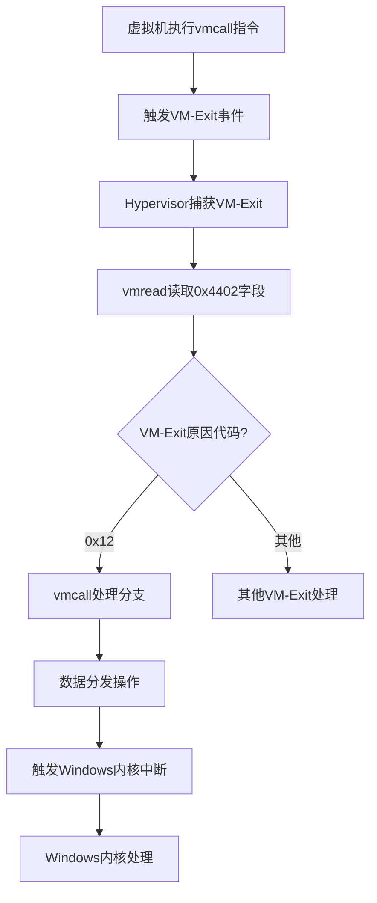
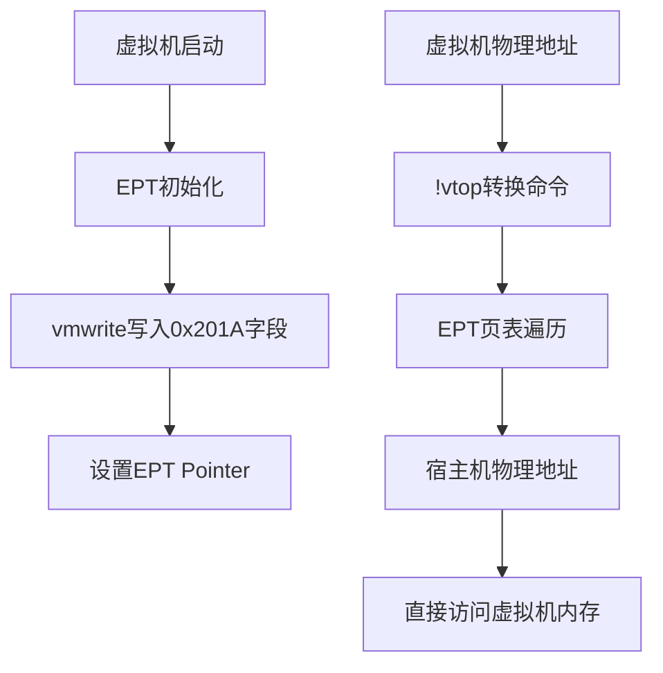
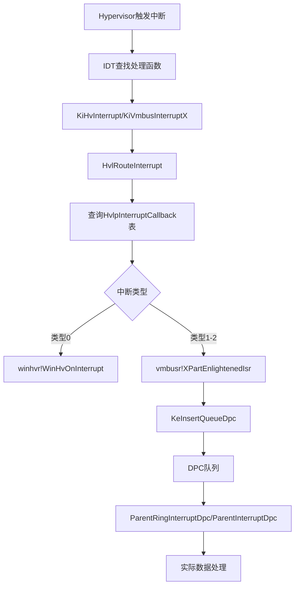
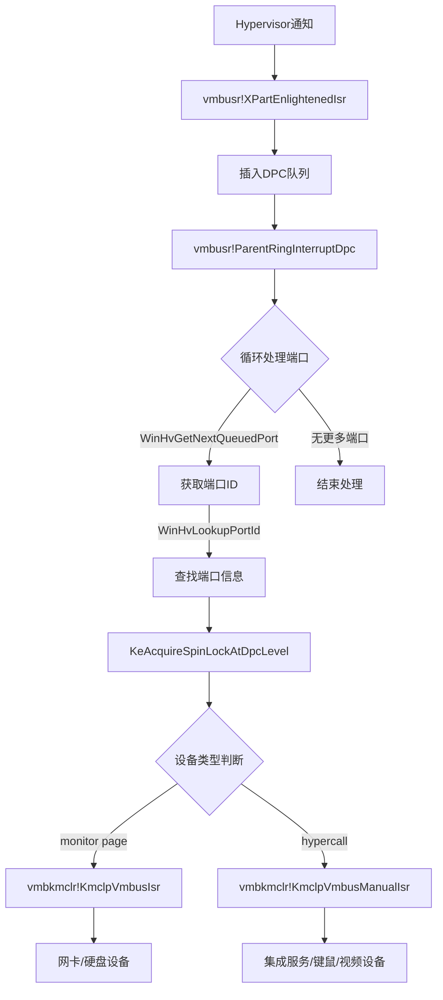
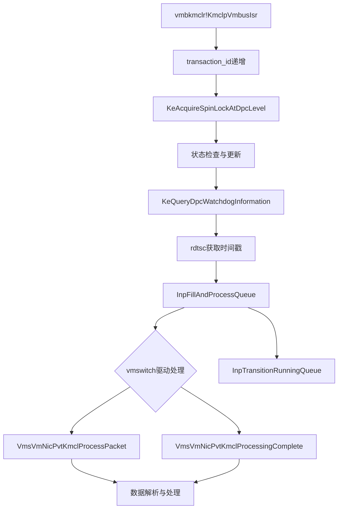
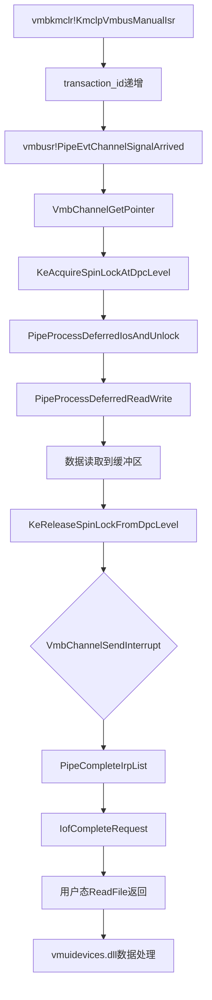

# LLM分析：Hyper-V安全从0到1(4) - Part 1

## 0. 基础信息

```
文章标题：Hyper-V安全从0到1(4)
作者/来源：看雪安全社区（https://bbs.kanxue.com/thread-222657-1.htm）
发布时间：2017-11-9
分析时间：2026-04-26
技术领域标签：Hyper-V, 虚拟化安全, VT-x, EPT, Windows内核, 漏洞挖掘
原文链接：https://bbs.kanxue.com/thread-222657-1.htm
```

---

## 1. 总体摘要

### 1.1 段落核心结论

**第1段（4.3 Hypervisor层 - vmcall指令处理）：** 文章介绍了虚拟机通过执行vmcall指令触发VM-Exit事件后，Hypervisor层如何读取VM-Exit原因代码（0x4402字段）并进行处理。通过IDA搜索和WinDbg动态调试，定位到处理vmcall指令的代码位置，分析了从VM-Exit到数据分发的完整流程。

**第2段（4.3 Hypervisor层 - EPT内存映射）：** 详细阐述了Hyper-V中宿主机与虚拟机之间的内存映射机制，通过EPT（Extended-Page Table，扩展页表）实现。文章通过逆向分析和WinDbg调试，展示了如何获取EPT Pointer（0x201A字段），并将虚拟机物理地址转换为宿主机物理地址，实现了跨层内存访问。

**第3段（4.4 Windows内核层 - 中断处理）：** 介绍了Hypervisor层触发的中断如何在Windows内核中被处理。通过分析IDT（Interrupt Descriptor Table，中断描述符表）和中断回调表HvlpInterruptCallback，展示了从nt!KiHvInterrupt到nt!HvlRouteInterrupt再到具体处理函数vmbusr!XPartEnlightenedIsr的完整调用链。

**第4段（4.4 Windows内核层 - 数据分发）：** 深入分析了vmbusr!XPartEnlightenedIsr函数的实现，该函数通过调用KeInsertQueueDpc将DPC（Deferred Procedure Call，延迟过程调用）结构体插入队列，实现中断的延迟处理，最终由vmbusr!ParentRingInterruptDpc或vmbusr!ParentInterruptDpc完成实际的数据处理。

### 1.2 关键要点提炼

| 技术要点 | 说明 |
|---------|------|
| **VM-Exit原因代码** | 通过vmread读取0x4402字段，0x12表示vmcall指令触发 |
| **EPT Pointer** | 通过vmwrite写入0x201A字段，值为EPT页表基地址 |
| **物理地址转换** | 使用WinDbg的!vtop命令，以EPTP为dirbase进行地址转换 |
| **中断向量号** | 0x30-0x34分别对应KiHvInterrupt和KiVmbusInterrupt0-3 |
| **回调函数表** | HvlpInterruptCallback表存储了5个中断处理函数的地址 |
| **DPC延迟处理** | 通过KeInsertQueueDpc实现中断的异步处理 |

### 1.3 研究思路概括

该文章从Hypervisor层和Windows内核层两个维度，系统性地分析了Hyper-V的通信机制。研究路线遵循"指令触发→事件捕获→地址映射→中断分发→数据处理"的技术链条，通过静态逆向（IDA）与动态调试（WinDbg）相结合的方法，逐步揭示了vmcall指令处理流程、EPT内存映射原理以及Windows内核中断处理机制，为后续的漏洞挖掘提供了底层技术基础。

### 1.4 技术流程图

#### 图1：vmcall指令处理流程



#### 图2：EPT内存映射机制



#### 图3：Windows内核中断处理流程



---

## 2. 分段详解

### 2.1 vmcall指令的处理

本段讲述了**vmcall指令在Hypervisor层的处理机制**。实现过程使用了**VT-x虚拟化技术**的VM-Exit事件捕获方式，利用了Intel VT-x架构的**VMCS（Virtual Machine Control Structure，虚拟机控制结构）**字段读取原理，同时还需要满足**虚拟机已启用VT-x扩展**、**Hypervisor已正确配置VMCS**、**调试环境已建立（WinDbg+IDA）**等前置条件。

其中**VM-Exit原因代码读取与判断**的实现过程是：

```asm
; 读取VM-Exit原因代码（存储在VMCS的0x4402字段）
.text:FFFFF80000219629                 mov     eax, 4402h      ; 加载VMCS字段编号
.text:FFFFF8000021962E                 vmread  rcx, rax        ; 从VMCS读取数据到rcx
.text:FFFFF80000219631                 mov     [rbp+57h+var_A8], rcx  ; 保存到栈变量

; ... 中间代码省略 ...

; 判断VM-Exit原因是否为vmcall（0x12）
.text:FFFFF80000219D00                 cmp     edx, 12h        ; 比较原因代码是否为0x12
.text:FFFFF80000219D03                 jnz     loc_FFFFF80000219E37  ; 不是则跳转到其他处理
.text:FFFFF80000219D09                 mov     rax, [rdi+30h]  ; 获取相关数据结构
.text:FFFFF80000219D0D                 mov     dword ptr [rax+130h], 6  ; 设置状态标志

; 后续进行数据分发和中断触发
.text:FFFFF80000219D46                 call    sub_FFFFF800002BC17C  ; 调用处理函数
.text:FFFFF80000219D4B                 test    al, al          ; 检查返回值
.text:FFFFF80000219D4D                 jz      loc_FFFFF80000219DEF  ; 失败则跳转
```

**技术细节补充：**
- **vmcall指令**：Intel VT-x提供的特权指令，用于从非根模式（虚拟机）向根模式（Hypervisor）发起调用，触发VM-Exit事件。
- **VM-Exit原因代码**：Intel SDM Volume 3B定义了各种VM-Exit的原因编码，0x12专门对应vmcall指令执行。
- **vmread/vmwrite指令**：用于读写VMCS字段的特权指令，只能在根模式下执行。

---

### 2.2 宿主机与虚拟机内存映射

本段讲述了**Hyper-V中EPT（Extended-Page Table，扩展页表）内存映射机制**的实现原理。实现过程使用了**Intel EPT硬件辅助虚拟化**技术，利用了**多级页表遍历**的地址转换原理，同时还需要满足**虚拟机已启动并完成EPT初始化**、**拥有EPT Pointer（EPTP）值**、**WinDbg调试环境支持!vtop命令**等前置条件。

其中**EPT Pointer设置与地址转换**的实现过程是：

```asm
; EPT Pointer设置函数（虚拟机启动时调用）
.text:FFFFF800002A0AD8 sub_FFFFF800002A0AD8 proc near
.text:FFFFF800002A0AD8                 sub     rsp, 28h        ; 分配栈空间
.text:FFFFF800002A0ADC                 mov     r9, rcx         ; 保存参数

; ... 中间代码省略（EPT配置计算）...

; 将计算好的EPT Pointer写入VMCS的0x201A字段
.text:FFFFF800002A0B35 loc_FFFFF800002A0B35:   ; CODE XREF: sub_FFFFF800002A0AD8+41
.text:FFFFF800002A0B35                 mov     ecx, 201Ah      ; VMCS字段：EPT Pointer
.text:FFFFF800002A0B3A                 vmwrite rcx, rax        ; 写入EPTP值
.text:FFFFF800002A0B3D loc_FFFFF800002A0B3D:

; ... 后续代码省略 ...
```

**WinDbg调试中的地址转换过程：**

```asm
; 步骤1：获取EPT Pointer值
1: kd> r rax
rax=00000001ea40901e    ; EPTP值（作为!vtop的dirbase参数）

; 步骤2：使用!vtop进行地址转换
; 格式：!vtop <dirbase> <VirtualAddress>
1: kd> !vtop 1ea40901e 0x96eee000
Amd64VtoP: Virt 00000000`96eee000, pagedir 00000001`ea409000 
Amd64VtoP: PML4E 00000001`ea409000      ; 第4级页表项
Amd64VtoP: PDPE 00000001`ea408010      ; 第3级页表项  
Amd64VtoP: PDE 00000001`4da3a5b8       ; 第2级页表项
Amd64VtoP: PTE 00000001`4daf3770       ; 第1级页表项
Amd64VtoP: Mapped phys 00000001`972ee000  ; 转换后的宿主机物理地址
Virtual address 96eee000 translates to physical address 1972ee000.

; 步骤3：验证转换结果（读取宿主机物理内存）
1: kd> !db 1972ee000
#1972ee000 41 41 41 41 41 41 41 41-41 41 41 41 41 41 41 41 AAAAAAAAAAAAAAAA
; 内容与虚拟机中的数据一致，验证成功
```

**技术细节补充：**
- **EPT（Extended-Page Table）**：Intel VT-x提供的硬件辅助内存虚拟化技术，通过额外的页表层级实现客户机物理地址（GPA）到宿主机物理地址（HPA）的转换。
- **EPTP（EPT Pointer）**：指向EPT页表基地址的指针，存储在VMCS的0x201A字段。
- **四级页表**：x64架构使用PML4E、PDPE、PDE、PTE四级页表结构，EPT同样遵循此结构。

---

### 2.3 Windows内核层中断处理

本段讲述了**Hypervisor通知在Windows内核中的中断处理机制**。实现过程使用了**x86中断描述符表（IDT）**和**回调函数表分发**方式，利用了Windows内核的**中断向量分配**和**函数指针表查询**原理，同时还需要满足**Windows 10企业版Build 14393**、**Hyper-V已启用**、**WinDbg内核调试权限**等前置条件。

其中**中断向量注册与分发**的实现过程是：

```asm
; IDT中注册的中断处理函数（!idt命令输出）
; 向量号0x30-0x34分别对应以下处理函数
30: fffff803c45d88c0 nt!KiHvInterrupt        ; Hypervisor通用中断
31: fffff803c45d8c30 nt!KiVmbusInterrupt0    ; VMBus中断0
32: fffff803c45d8f90 nt!KiVmbusInterrupt1    ; VMBus中断1
33: fffff803c45d92f0 nt!KiVmbusInterrupt2    ; VMBus中断2（未使用）
34: fffff803c45d9650 nt!KiVmbusInterrupt3    ; VMBus中断3（未使用）

; HvlRouteInterrupt函数：中断分发入口
HvlRouteInterrupt proc near
    mov     [rsp+arg_0], ecx    ; 保存中断类型参数
    sub     rsp, 28h            ; 分配栈空间
    movsxd  rcx, [rsp+28h+arg_0]; 将中断类型符号扩展为64位
    lea     rdx, HvlpInterruptCallback  ; 加载回调表地址
    add     rsp, 28h            ; 恢复栈
    jmp     qword ptr [rdx+rcx*8]  ; 跳转到对应回调函数（查表调用）
HvlRouteInterrupt endp
```

**HvlpInterruptCallback回调函数表内容：**

```asm
; 使用dps命令查看回调函数表（每个条目8字节，为函数指针）
0: kd> dps nt!HvlpInterruptCallback
 fffff802`cf620548  fffff80b`2aca29f0 winhvr!WinHvOnInterrupt      ; 索引0：Hypervisor通用中断
 fffff802`cf620550  fffff80b`2ac21360 vmbusr!XPartEnlightenedIsr   ; 索引1：VMBus中断0
 fffff802`cf620558  fffff80b`2ac21360 vmbusr!XPartEnlightenedIsr   ; 索引2：VMBus中断1
 fffff802`cf620560  fffff802`cf3976d0 nt!EmpCheckErrataList        ; 索引3：未初始化（占位）
 fffff802`cf620568  fffff802`cf3976d0 nt!EmpCheckErrataList        ; 索引4：未初始化（占位）
```

**中断类型与处理函数对应关系表：**

| 中断向量 | 中断处理函数 | 回调表索引 | 实际处理函数 | 使用状态 |
|---------|-------------|-----------|-------------|---------|
| 0x30 | KiHvInterrupt | 0 | winhvr!WinHvOnInterrupt | 已使用 |
| 0x31 | KiVmbusInterrupt0 | 1 | vmbusr!XPartEnlightenedIsr | 已使用 |
| 0x32 | KiVmbusInterrupt1 | 2 | vmbusr!XPartEnlightenedIsr | 已使用 |
| 0x33 | KiVmbusInterrupt2 | 3 | nt!EmpCheckErrataList | 未使用 |
| 0x34 | KiVmbusInterrupt3 | 4 | nt!EmpCheckErrataList | 未使用 |

**技术细节补充：**
- **IDT（Interrupt Descriptor Table）**：x86架构用于存储中断处理程序入口地址的数据结构，每个中断向量对应一个门描述符。
- **VMBus（Virtual Machine Bus）**：Hyper-V提供的半虚拟化通信总线，用于虚拟机与宿主机之间的高效通信。
- **回调函数表**：Windows内核使用函数指针表实现中断的多路分发，通过索引快速定位处理函数。

---

### 2.4 数据分发与DPC处理

本段讲述了**VMBus中断的数据分发机制**。实现过程使用了**DPC（Deferred Procedure Call，延迟过程调用）队列插入**方式，利用了Windows内核的**异步中断处理**原理，同时还需要满足**中断上下文限制**、**DPC对象已初始化**、**目标处理器已指定**等前置条件。

其中**DPC插入与延迟处理**的实现过程是：

```asm
; vmbusr!XPartEnlightenedIsr函数：VMBus中断服务例程
XPartEnlightenedIsr proc near
    sub     rsp, 28h                    ; 分配栈空间
    mov     eax, gs:1A4h                ; 获取当前处理器编号
    xor     r8d, r8d                    ; SystemArgument2 = 0
    mov     edx, eax                    ; 保存处理器号
    lea     eax, [rcx-1]                ; 计算索引（rcx为中断类型）
    movsxd  rcx, eax                    ; 符号扩展
    lea     rcx, [rcx+rdx*2]            ; 计算DPC对象索引
    xor     edx, edx                    ; SystemArgument1 = 0
    shl     rcx, 6                      ; 乘以64（DPC结构体大小对齐）
    add     rcx, cs:P                   ; 加上DPC基地址，得到DPC对象指针
    call    cs:__imp_KeInsertQueueDpc   ; 插入DPC到队列（关键调用）
    cmp     cs:byte_1C0014769, 0        ; 检查是否需要立即结束中断
    jnz     short loc_1C000139C         ; 需要则跳转
loc_1C0001397:
    add     rsp, 28h                    ; 恢复栈
    retn                                ; 返回
loc_1C000139C:
    call    cs:__imp_HvlPerformEndOfInterrupt  ; 通知Hypervisor中断处理完成
    jmp     short loc_1C0001397         ; 返回
XPartEnlightenedIsr endp
```

**DPC结构体内容分析：**

```c
// 使用dt命令查看DPC结构体（_KDPC）
0: kd> dt _kdpc @rcx
win32k!_KDPC
+0x000 TargetInfoAsUlong : 0x113       // 目标处理器信息打包
+0x000 Type             : 0x13 ''      // 对象类型（DPC对象为0x13）
+0x001 Importance       : 0x1 ''       // 重要性级别
+0x002 Number           : 0            // 目标处理器号
+0x008 DpcListEntry     : _SINGLE_LIST_ENTRY  // DPC链表节点
+0x010 ProcessorHistory : 1            // 处理器历史记录
+0x018 DeferredRoutine  : 0xfffff80b`2ac211f0 void  vmbusr!ParentRingInterruptDpc +0  // 延迟执行函数
+0x020 DeferredContext  : 0xfffff80b`2ac344e0 Void  // 传递给延迟函数的上下文
+0x028 SystemArgument1  : (null)       // 系统参数1
+0x030 SystemArgument2  : (null)       // 系统参数2
+0x038 DpcData          : (null)       // DPC数据
```

**两种DPC延迟处理函数：**

| DPC类型 | DeferredRoutine | 功能说明 |
|--------|----------------|---------|
| Ring DPC | vmbusr!ParentRingInterruptDpc | 处理VMBus环形缓冲区数据 |
| Interrupt DPC | vmbusr!ParentInterruptDpc | 处理VMBus通用中断事件 |

**技术细节补充：**
- **DPC（Deferred Procedure Call）**：Windows内核机制，用于将中断处理中不需要立即执行的工作推迟到IRQL（Interrupt Request Level）降低后执行，避免长时间占用高IRQL。
- **KeInsertQueueDpc**：内核API，将DPC对象插入到指定处理器的DPC队列中，等待IRQL降低到DISPATCH_LEVEL时执行。
- **DeferredRoutine**：DPC结构体中存储的函数指针，指向实际执行数据处理的函数。
- **IRQL（Interrupt Request Level）**：Windows中断请求级别，高IRQL会屏蔽低优先级中断，DPC机制用于减少高IRQL占用时间。

---

## 3. 总结

本文深入分析了Hyper-V架构中从Hypervisor层到Windows内核层的通信机制，涵盖了：

1. **vmcall指令处理流程**：从虚拟机执行vmcall触发VM-Exit，到Hypervisor读取原因代码并进行分发
2. **EPT内存映射机制**：通过扩展页表实现虚拟机物理地址到宿主机物理地址的转换
3. **中断处理架构**：IDT注册、回调函数表分发、VMBus中断服务例程
4. **数据分发机制**：DPC延迟处理实现异步中断处理，提高系统响应效率

这些底层机制的理解对于Hyper-V安全研究和漏洞挖掘具有重要的基础意义。
# Hyper-V 漏洞挖掘系列文章分析 - 第4篇 Part2

## 基础信息

```
文章标题：Hyper-V 漏洞挖掘 0-5 系列 - 第4篇（续）
作者/来源：看雪论坛
分析时间：2026-04-26
技术领域标签：Hyper-V, Windows内核, VMBus, 虚拟化安全, 驱动逆向
原文链接：https://bbs.kanxue.com/
```

---

## 总体摘要

**第1段（ParentRingInterruptDpc函数分析）**：文章详细分析了`vmbusr!ParentRingInterruptDpc`函数的实现，该函数负责处理从Hypervisor层发来的中断通知，通过循环调用`WinHvGetNextQueuedPort`和`WinHvLookupPortId`获取端口信息，最终分发到具体的设备处理函数。

**第2段（设备识别与调试方法）**：介绍了通过修改Linux内核驱动，在`vmbus_sendpacket`调用处添加日志输出`connection_id`，从而在Windows宿主机端通过WinDbg调试时识别具体虚拟设备的方法，解决了多设备并发调试的困扰。

**第3段（KmclpVmbusIsr函数分析）**：详细逆向了`vmbkmclr!KmclpVmbusIsr`函数，该函数处理虚拟机通过monitor page方式发送的数据，涉及自旋锁保护、事务ID递增、时间戳计算等操作，最终调用`InpFillAndProcessQueue`将数据传递给虚拟设备驱动（如vmswitch.sys）。

**第4段（Windows应用层数据流）**：介绍了`vmbkmclr!KmclpVmbusManualIsr`分支的处理流程，该分支处理通过hypercall方式发送的数据，经过`PipeEvtChannelSignalArrived`和`PipeProcessDeferredIosAndUnlock`等函数，最终将数据传递到用户态组件（如vmuidevices.dll）。

**总结**：该文章从Windows内核层深入分析了Hyper-V虚拟设备数据传输的完整流程，重点剖析了`ParentRingInterruptDpc`中断处理函数的设备分发机制，提出了基于`connection_id`的设备识别调试方法，并分别追踪了monitor page和hypercall两种数据传输路径在内核层和应用层的处理流程，为Hyper-V漏洞挖掘提供了系统性的技术基础。

---

## 技术流程图

### 图1：ParentRingInterruptDpc中断处理流程



### 图2：KmclpVmbusIsr数据处理流程



### 图3：Windows应用层数据流（KmclpVmbusManualIsr分支）



---

## 分段详解

### 4.4. Windows内核层（续）：ParentRingInterruptDpc函数、设备识别方法

#### 4.4.1 ParentRingInterruptDpc函数实现机制

本段讲述了`vmbusr!ParentRingInterruptDpc`函数的实现机制。实现过程使用了**DPC（Deferred Procedure Call，延迟过程调用）**方式，利用了Windows内核中断处理的**延迟执行**原理，同时还需要满足**端口队列非空**、**成功获取端口ID**、**自旋锁保护**等前置条件。其中核心逻辑的实现过程是通过循环遍历所有待处理的端口，对每个端口调用`WinHvGetNextQueuedPort`获取端口ID，然后使用`WinHvLookupPortId`查找端口信息，最后通过函数指针分发到具体的设备处理函数。

```asm
; ParentRingInterruptDpc函数核心逻辑
ParentRingInterruptDpc+12   loc_1C0001202:
    mov     [rsp+38h+arg_0], rbp
    mov     [rsp+38h+arg_8], rsi
    mov     [rsp+38h+arg_10], r14

loc_1C0001211:
    mov     ecx, ebx                    ; 端口索引
    call    cs:__imp_WinHvGetNextQueuedPort  ; 获取下一个队列端口
    test    eax, eax
    jz      short loc_1C000128F         ; 无更多端口则退出
    lea     rdx, [rsp+38h+var_18]
    mov     ecx, eax
    call    cs:__imp_WinHvLookupPortId  ; 查找端口ID
    mov     rbp, [rsp+38h+var_18]       ; rbp指向端口结构
    xor     r14b, r14b
    lea     rcx, [rbp+28h]              ; SpinLock地址
    call    cs:__imp_KeAcquireSpinLockAtDpcLevel  ; 获取自旋锁
    mov     rcx, [rbp+18h]
    test    rcx, rcx
    jz      short loc_1C000126D
    mov     rax, [rcx]                  ; 获取回调函数指针
    ; vmbkmclr!KmclpVmbusIsr 或 vmbkmclr!KmclpVmbusManualIsr
    mov     rcx, [rcx+8]                ; _QWORD参数
    call    cs:__guard_dispatch_icall_fptr  ; 间接调用处理函数
```

**关键发现**：在`ParentRingInterruptDpc+0x55`处，通过`rcx`寄存器指向的结构体可以获取设备回调函数指针。调试结果显示存在两种分发目标：
- `vmbkmclr!KmclpVmbusIsr`：处理monitor page方式的数据（网卡、硬盘设备）
- `vmbkmclr!KmclpVmbusManualIsr`：处理hypercall方式的数据（集成服务、键盘、鼠标、动态内存、视频设备）

#### 4.4.2 设备识别与调试方法

本段讲述了通过`connection_id`识别虚拟设备的调试方法。实现过程使用了**修改Linux内核驱动**的方式，利用了`vmbus_channel`结构体中`offermsg.connection_id`字段的唯一性原理，同时还需要满足**重新编译Linux内核**、**虚拟机使用新内核启动**、**宿主机WinDbg调试**等前置条件。其中核心逻辑的实现过程是在Linux驱动的`synthvid_send`函数中添加`printk`日志输出`connection_id`，然后在Windows宿主机端通过WinDbg在`ParentRingInterruptDpc+0x55`处设置断点，查看`rbp+0x38`位置的内存数据即可获取`connection_id`值。

```c
// Linux内核修改示例（hyperv_fb.c）
static inline int synthvid_send(struct hv_device *hdev,
                                struct synthvid_msg *msg)
{
    static atomic64_t request_id = ATOMIC64_INIT(0);
    int ret;
    msg->pipe_hdr.type = PIPE_MSG_DATA;
    msg->pipe_hdr.size = msg->vid_hdr.size;
    
    struct vmbus_channel *tmp_chl = hdev->channel;  // 新加行：获取通道指针
    
    printk(KERN_INFO "[+]hyperv_fb conn_id:0x%lx\n",  // 新加行：打印connection_id
           tmp_chl->offermsg.connection_id);
    
    ret = vmbus_sendpacket(hdev->channel, msg,
                           msg->vid_hdr.size + sizeof(struct pipe_msg_hdr),
                           atomic64_inc_return(&request_id),
                           VM_PKT_DATA_INBAND, 0);
    if (ret)
        pr_err("Unable to send packet via vmbus\n");
    return ret;
}
```

**调试验证**：
```asm
; WinDbg调试命令与结果
0: kd> bp vmbusr!ParentRingInterruptDpc+0x55;g;
Breakpoint 0 hit
vmbusr!ParentRingInterruptDpc+0x55:
 fffff80b`2ac21245 488b01          mov     rax,qword ptr [rcx]
0: kd> dd rbp+38
 ffff8c8f`2c234338  00010005 00000000 00010000 00000000
 ; 0x00010005 即为 connection_id
```

**术语说明**：
- **DPC（Deferred Procedure Call）**：延迟过程调用，Windows内核中的一种中断后处理机制，用于将中断处理程序中的非紧急工作推迟到IRQL（中断请求级别）降低后执行。
- **connection_id**：VMBus通道连接标识符，用于唯一标识虚拟机与宿主机之间的通信通道，每个虚拟设备拥有唯一的connection_id。
- **monitor page**：Hyper-V中的一种内存共享机制，虚拟机通过修改特定内存页通知宿主机有数据待处理，无需执行特权指令。
- **hypercall**：Hyper-V提供的超级调用接口，虚拟机通过执行`vmcall`指令主动陷入Hypervisor，请求宿主机服务。

#### 4.4.3 KmclpVmbusIsr函数深度分析

本段讲述了`vmbkmclr!KmclpVmbusIsr`函数的实现机制。实现过程使用了**自旋锁同步**和**时间戳计算**方式，利用了Windows内核的**DPC Watchdog**监控机制，同时还需要满足**端口状态为运行中**、**事务ID有效**、**DPC超时检查通过**等前置条件。其中核心逻辑的实现过程是首先递增事务ID，然后获取自旋锁保护临界区，检查端口状态，查询DPC看门狗信息防止超时，读取时间戳计数器（TSC），最后调用`InpFillAndProcessQueue`函数处理数据包队列。

```asm
; KmclpVmbusIsr函数核心逻辑
KmclpVmbusIsr+1C    inc     qword ptr [rcx+5C0h]    ; transaction_id加1
KmclpVmbusIsr+23    lea     rsi, [rcx+40h]          ; 获取通道结构偏移
KmclpVmbusIsr+27    mov     eax, [rsi+8Ch]
KmclpVmbusIsr+2D    mov     rbx, rcx                ; rbx保存通道指针
KmclpVmbusIsr+30    add     eax, [rsi+48h]
KmclpVmbusIsr+33    mov     ecx, [rsi+4Ch]

loc_1C0002436:
    mov     [rsp+68h+arg_8], rbp
    sub     eax, ecx
    jz      loc_1C00059B2               ; 队列为空则跳转
    lea     eax, [rcx+1]
    mov     r14b, 1
    mov     [rsi+4Ch], eax              ; 更新队列索引

loc_1C000244C:
    lea     rcx, [rbx+380h]             ; SpinLock地址
    xor     dil, dil
    call    cs:__imp_KeAcquireSpinLockAtDpcLevel  ; 获取自旋锁
    cmp     dword ptr [rbx+388h], 4     ; 检查端口状态
    jnz     short loc_1C000248D
    mov     rax, [rbx+58h]
    mov     dil, 1
    mov     dword ptr [rax+8], 1
    mov     dword ptr [rbx+388h], 1     ; 更新状态为运行中

loc_1C000248D:
    lea     rcx, [rbx+380h]
    call    cs:__imp_KeReleaseSpinLockFromDpcLevel  ; 释放自旋锁
    test    dil, dil
    jz      loc_1C0002546
    cmp     qword ptr [rbx+4F0h], 0FFFFFFFFFFFFFFFFh
    jz      loc_1C00059C0
    
    ; 时间戳计算与DPC看门狗检查
    mov     rax, 0FFFFF78000000320h     ; KUSER_SHARED_DATA地址
    mov     rax, [rax]                  ; 获取当前时间
    mov     rdx, rax
    sub     rdx, [rbx+4E0h]             ; 计算时间差
    jnz     loc_1C000257B

loc_1C00024CE:
    mov     rax, [rbx+4F0h]
    cmp     [rbx+4E8h], rax
    jnb     loc_1C00025DF
    lea     rcx, [rsp+68h+var_38]
    call    cs:__imp_KeQueryDpcWatchdogInformation  ; 查询DPC看门狗信息
    test    eax, eax
    js      short loc_1C000250A
    imul    ecx, [rsp+68h+var_30], 1Eh  ; 计算超时阈值
    mov     eax, 51EB851Fh              ; 魔法数（用于除法优化）
    mul     ecx
    shr     edx, 5                      ; 快速除法计算
    cmp     [rsp+68h+var_2C], edx
    jb      loc_1C00025DF               ; 超时则跳转

loc_1C000250A:
    rdtsc                               ; 读取时间戳计数器
    shl     rdx, 20h
    mov     r8d, 1Eh
    or      rax, rdx                    ; 合并高32位和低32位
    mov     rcx, rbx
    mov     dl, 2
    mov     rdi, rax                    ; 保存起始时间戳
    call    InpFillAndProcessQueue      ; 核心：填充并处理队列
    mov     r8d, eax
    rdtsc                               ; 再次读取时间戳
    shl     rdx, 20h
    or      rax, rdx
    sub     rax, rdi                    ; 计算处理耗时
    add     [rbx+4E8h], rax             ; 累加总耗时

loc_1C000253C:
    mov     dl, 1
    mov     rcx, rbx
    call    InpTransitionRunningQueue   ; 转换运行队列
```

**关键调用链**：
```
vmbkmclr!KmclpVmbusIsr
    └── InpFillAndProcessQueue
            ├── vmswitch!VmsVmNicPvtKmclProcessPacket      (InpFillAndProcessQueue+16E)
            └── vmswitch!VmsVmNicPvtKmclProcessingComplete (InpFillAndProcessQueue+2CA)
```

**术语说明**：
- **TSC（Time Stamp Counter）**：时间戳计数器，x86处理器提供的64位寄存器，用于高精度时间测量。
- **DPC Watchdog**：DPC看门狗，Windows内核机制，用于检测DPC例程是否执行时间过长，防止系统挂起。
- **IRQL（Interrupt Request Level）**：中断请求级别，Windows内核用于管理中断优先级的机制，DPC级别为2。

---

### 4.5. Windows应用层（部分）

#### 4.5.1 KmclpVmbusManualIsr分支处理流程

本段讲述了`vmbkmclr!KmclpVmbusManualIsr`函数的实现机制。实现过程使用了**函数指针分发**方式，利用了VMBus管道通信的**信号到达通知**原理，同时还需要满足**通道指针有效**、**事务ID递增成功**、**回调函数注册**等前置条件。其中核心逻辑的实现过程是递增事务ID后，通过`__guard_dispatch_icall_fptr`间接调用`vmbusr!PipeEvtChannelSignalArrived`函数，该函数负责处理管道信号到达事件，最终准备数据供用户态组件读取。

```asm
; KmclpVmbusManualIsr函数核心逻辑
KmclpVmbusManualIsr     push    rbx
KmclpVmbusManualIsr+2   sub     rsp, 20h
KmclpVmbusManualIsr+6   mov     rax, [rcx+710h]         ; 获取回调函数指针
KmclpVmbusManualIsr+D   mov     rbx, rcx                ; rbx保存通道指针
KmclpVmbusManualIsr+10  inc     qword ptr [rcx+5C0h]    ; transaction_id加1
KmclpVmbusManualIsr+17  call    cs:__guard_dispatch_icall_fptr  ; 间接调用
                        ; call   vmbusr!PipeEvtChannelSignalArrived
KmclpVmbusManualIsr+1D  test    al, al
KmclpVmbusManualIsr+1F  jz      loc_1C00066FC           ; 调用失败则跳转
KmclpVmbusManualIsr+25  mov     al, 1
KmclpVmbusManualIsr+27  
loc_1C0004A87:
    add     rsp, 20h
    pop     rbx
    retn
```

#### 4.5.2 PipeEvtChannelSignalArrived函数分析

本段讲述了`vmbusr!PipeEvtChannelSignalArrived`函数的实现机制。实现过程使用了**WPP（Windows Software Trace Preprocessor）跟踪**和**自旋锁保护**方式，利用了VMBus通道的**指针获取**和**延迟IO处理**原理，同时还需要满足**成功获取通道指针**、**获取自旋锁**、**队列索引更新**等前置条件。其中核心逻辑的实现过程是首先调用`VmbChannelGetPointer`获取通道私有数据指针，然后获取自旋锁进入临界区，更新读写队列索引，记录WPP跟踪日志，最后调用`PipeProcessDeferredIosAndUnlock`处理延迟的IO请求。

```asm
; PipeEvtChannelSignalArrived函数核心逻辑
PipeEvtChannelSignalArrived     mov     [rsp+arg_0], rbx
PipeEvtChannelSignalArrived+5   push    rdi
PipeEvtChannelSignalArrived+6   sub     rsp, 30h
PipeEvtChannelSignalArrived+A   call    cs:__imp_VmbChannelGetPointer  ; 获取通道指针
                                ; VmbChannelGetPointer内部实现：
                                ; mov     rax, [rcx+7E8h]
                                ; retn
PipeEvtChannelSignalArrived+10  mov     rcx, rax                ; SpinLock
PipeEvtChannelSignalArrived+13  mov     rbx, rax                ; rbx保存通道指针
PipeEvtChannelSignalArrived+16  call    cs:__imp_KeAcquireSpinLockAtDpcLevel  ; 获取自旋锁
PipeEvtChannelSignalArrived+1C  mov     ecx, [rbx+0CCh]         ; 读取写索引
PipeEvtChannelSignalArrived+22  add     ecx, [rbx+88h]          ; 加上基础偏移
PipeEvtChannelSignalArrived+28  mov     eax, [rbx+8Ch]          ; 读取读索引
PipeEvtChannelSignalArrived+2E  cmp     ecx, eax
PipeEvtChannelSignalArrived+30  jz      short loc_1C0001920     ; 索引相等则跳转
PipeEvtChannelSignalArrived+32  lea     ecx, [rax+1]            ; 读索引加1
PipeEvtChannelSignalArrived+35  mov     dil, 1                  ; 设置处理标志
PipeEvtChannelSignalArrived+38  mov     [rbx+8Ch], ecx          ; 更新读索引
PipeEvtChannelSignalArrived+3E  jmp     short loc_1C0001923

loc_1C0001920:
    xor     dil, dil                    ; 清除处理标志（无数据）

loc_1C0001923:
    ; WPP跟踪日志记录（可选）
    mov     rcx, cs:WPP_GLOBAL_Control
    lea     rax, WPP_GLOBAL_Control
    cmp     rcx, rax
    jz      short loc_1C0001969         ; 未启用跟踪则跳过
    test    dword ptr [rcx+2Ch], 100000h
    jz      short loc_1C0001969
    cmp     byte ptr [rcx+29h], 5
    jb      short loc_1C0001969
    ; ... WPP日志记录代码 ...

loc_1C0001969:
    mov     rcx, rbx                    ; SpinLock
    call    PipeProcessDeferredIosAndUnlock  ; 处理延迟IO并释放锁
PipeEvtChannelSignalArrived+91  mov     rbx, [rsp+38h+arg_0]
PipeEvtChannelSignalArrived+96  movzx   eax, dil                    ; 返回处理标志
PipeEvtChannelSignalArrived+9A  add     rsp, 30h
PipeEvtChannelSignalArrived+9E  pop     rdi
PipeEvtChannelSignalArrived+9F  retn
```

**术语说明**：
- **WPP（Windows Software Trace Preprocessor）**：Windows软件跟踪预处理器，用于在驱动程序中插入跟踪日志，便于调试和性能分析。
- **IRP（I/O Request Packet）**：IO请求包，Windows内核中用于表示IO操作的数据结构。

#### 4.5.3 PipeProcessDeferredIosAndUnlock函数与数据传递到用户态

本段讲述了`vmbusr!PipeProcessDeferredIosAndUnlock`函数的实现机制。实现过程使用了**延迟IO处理**和**IRP完成**方式，利用了Windows内核的**异步IO**和**中断通知**原理，同时还需要满足**数据已读取到缓冲区**、**自旋锁释放**、**IRP列表有效**等前置条件。其中核心逻辑的实现过程是首先调用`PipeProcessDeferredReadWrite`将虚拟机传来的数据读取到驱动缓冲区，然后释放自旋锁，根据需要发送中断通知，最后调用`PipeCompleteIrpList`完成IRP列表，触发`IofCompleteRequest`使用户态的`ReadFile`函数返回。

```asm
; PipeProcessDeferredIosAndUnlock函数核心逻辑
PipeProcessDeferredIosAndUnlock     mov     [rsp+arg_0], rbx
PipeProcessDeferredIosAndUnlock+5   push    rdi
PipeProcessDeferredIosAndUnlock+6   sub     rsp, 40h
PipeProcessDeferredIosAndUnlock+A   mov     rdi, rcx                ; rdi保存通道指针
PipeProcessDeferredIosAndUnlock+D   mov     rcx, cs:WPP_GLOBAL_Control
PipeProcessDeferredIosAndUnlock+14  lea     rax, WPP_GLOBAL_Control
PipeProcessDeferredIosAndUnlock+1B  cmp     rcx, rax
PipeProcessDeferredIosAndUnlock+1E  jz      short loc_1C00087AB     ; 跳过WPP日志

loc_1C00087AB:
    lea     rax, [rsp+48h+var_18]
    mov     rcx, rdi
    mov     [rsp+48h+var_10], rax
    lea     rdx, [rsp+48h+var_18]
    lea     rax, [rsp+48h+var_18]
    mov     [rsp+48h+var_18], rax
    call    PipeProcessDeferredReadWrite  ; 核心：处理延迟读写
PipeProcessDeferredIosAndUnlock+74  mov     rcx, rdi                ; SpinLock
PipeProcessDeferredIosAndUnlock+77  mov     bl, al                  ; 保存返回值
PipeProcessDeferredIosAndUnlock+79  call cs:__imp_KeReleaseSpinLockFromDpcLevel  ; 释放自旋锁
PipeProcessDeferredIosAndUnlock+7F  test    bl, bl
PipeProcessDeferredIosAndUnlock+81  jz      short loc_1C00087E8     ; 无需中断则跳转
PipeProcessDeferredIosAndUnlock+83  mov     rcx, [rdi+100h]
PipeProcessDeferredIosAndUnlock+8A  call cs:__imp_VmbChannelSendInterrupt  ; 发送通道中断

loc_1C00087E8:
    lea     rcx, [rsp+48h+var_18]
    call    PipeCompleteIrpList     ; 完成IRP列表
PipeProcessDeferredIosAndUnlock+9A  mov     rbx, [rsp+48h+arg_0]
PipeProcessDeferredIosAndUnlock+9F  add     rsp, 40h
PipeProcessDeferredIosAndUnlock+A3  pop     rdi
PipeProcessDeferredIosAndUnlock+A4  retn
```

**用户态数据接收流程**：

当`vmbusr!PipeCompleteIrpList`调用`IofCompleteRequest`后，用户态组件（如`vmuidevices.dll`）中等待的`ReadFile`调用返回，数据被传递到用户态缓冲区。

```cpp
// vmuidevices.dll中的数据处理示意（伪代码）
// vmuidevices!VMBusPipeTransportImpl<VMBusPipeIO,VMBusPipeServerDisposition>::IoOperation

class VMBusPipeTransportImpl {
public:
    void IoOperation() {
        BYTE buffer[BUFFER_SIZE];
        DWORD bytesRead;
        
        // 阻塞等待，直到内核态IofCompleteRequest完成
        BOOL result = ReadFile(
            hPipe,              // 管道句柄
            buffer,             // 接收缓冲区
            BUFFER_SIZE,        // 缓冲区大小
            &bytesRead,         // 实际读取字节数
            &overlapped         // 异步IO结构
        );
        
        if (result || GetLastError() == ERROR_IO_PENDING) {
            // 等待IO完成
            WaitForSingleObject(overlapped.hEvent, INFINITE);
            GetOverlappedResult(hPipe, &overlapped, &bytesRead, FALSE);
            
            // 此时buffer中包含从虚拟机发来的数据
            ProcessPacket(buffer, bytesRead);  // 解析并处理数据
        }
    }
    
private:
    void ProcessPacket(BYTE* data, DWORD size) {
        // 根据数据类型进行不同处理
        // 例如：视频帧数据、鼠标事件、键盘输入等
    }
};
```

**术语说明**：
- **IRP（I/O Request Packet）**：IO请求包，Windows内核中用于表示IO操作的数据结构，包含操作类型、缓冲区、状态等信息。
- **IofCompleteRequest**：Windows内核函数，用于完成IRP，将IO操作结果返回给调用者。
- **ReadFile**：Windows API函数，用于从文件、管道等句柄读取数据，在内核态对应IRP_MJ_READ操作。
- **vmuidevices.dll**：Hyper-V用户态虚拟设备组件，负责处理视频、输入设备等用户态交互。

---

## 总结

本文深入分析了Hyper-V虚拟设备数据从虚拟机到Windows宿主机内核层再到应用层的完整传输流程。主要技术要点包括：

1. **中断处理机制**：`ParentRingInterruptDpc`函数作为DPC例程，负责轮询处理所有待处理的VMBus端口，通过函数指针分发到不同的设备处理函数。

2. **设备识别方法**：通过修改Linux内核驱动输出`connection_id`，结合WinDbg调试，可以精确定位特定虚拟设备的数据流，解决多设备并发调试难题。

3. **双路径数据处理**：
   - **Monitor Page路径**：`KmclpVmbusIsr`处理网卡、硬盘等高性能设备的数据，直接在内核态完成处理。
   - **Hypercall路径**：`KmclpVmbusManualIsr`处理集成服务、输入设备等需要用户态交互的数据，通过IRP机制传递到用户态组件。

4. **同步与性能优化**：使用自旋锁保护临界区，DPC Watchdog防止超时，TSC时间戳进行性能监控，确保数据传输的高效与稳定。

这些技术细节为Hyper-V漏洞挖掘提供了重要的攻击面分析基础，特别是在VMBus协议处理、数据包解析、用户态/内核态交互等关键环节存在潜在的安全风险点。
