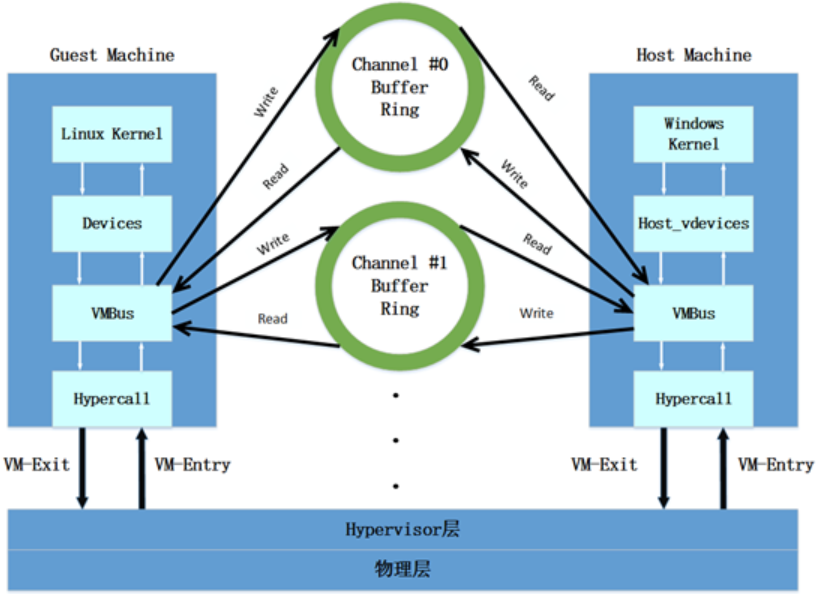

# Hyper-V 学习笔记

## 1. Hyper-V 基础知识

### Hypervisor 分类

* **Type 1 (Bare Metal):** OS / OS / OS / Hypervisor (直接运行在硬件上)
  * **图示: 硬件 -> Hyper-V -> OS**
  * **例子: Hyper-V, ESXi**
* **Type 2 (Hosted):** OS / OS / OS / Hypervisor (运行在宿主 OS 上)
  * **例子: VM Workstation**

### Hyper-V 体系结构

* **① 按分区/隔离**
  * **Root / Parents Partitions:** 至少 1 个 Root Partition 运行 Windows 系统。
  * **Child Partitions:** 由 VMS 创建。
* **组件:**
  * **VMS (Virtual Machine Management Service):** 创建 Child Partition。
  * **VM 管理器:** 管理虚拟机。
  * **HARDWARE:**
    * **直接访问 HW (no access) -> 通过 ****Hypercall** -> **VMbus** or **Hypervisor** -> **Virtual Device** -> 投影 (Projection) -> Partitions。

### 关键概念 (右侧笔记)

* **VSP (Virtual Service Provider):** 位于 Root Partition。
* **VSC (Virtual Service Customer):** 位于 Child Partition。
* **VMBus:** 连接 VSP 和 VSC。
* **Enlightened I/O:** 虚拟加速和实现。
  * **基于高效通信协议 [CSM]。**
  * **高级 IO。**
* **VMMS:** 虚拟机管理服务 -> 管理 Child Partitions。
* **VMWP:** 虚拟机工作进程。
* **Win HV:** 桥，在分配的 OS 和 Hypervisor 之间。
  * **支持 driver (虚设备驱动?)。**
  * **按 Windows 调用约定，调用 Hypervisor。**
* **Windows Hypervisor Platform:**
  * **对 Hypervisor 接口功能进行规范化处理。**
* **VHD:** 虚拟化基础设施驱动 -> 虚拟服务管理。
* **分区内存管理**
* **(注: 微软官方)**

---

## 2. Hyper-V 启动与安全基础

### 基础知识与 BLOG

* **路径:** 基础知识 -> 攻防名词 -> CVE 复现 -> 功能实现 漏洞
* **BLOG:**
  * **VBS (Virtualization Based Security):** 基于 VM 的安全。
    * **基于 Hyper-V -> 其核心: ****HVCI** (Hypervisor-enforced Code Integrity)。
  * **Root Partition < init - Hvload.dll**
  * **Hyper-V | Security Kernel**

### Hvload.dll 流程

* **① 查 Hypervisor 版本:**
  * `Amd64`: `Hvix64.exe` (笔记可能指 `Hvax64.exe`)
  * `Intel`: `Hvix64.exe`
  * `ARM64`: `Hvload.exe`
  * **-> 虚拟机安全模块**
  * **-> 解析策略，加载 **`SecurityKernel.exe`
* **② CPUID:** 检查 CPU 是否支持硬件虚拟化等。
* **③ 复制 UEFI 物理内存映射。**
* **加载对应的 Hypervisor 的引擎/主控。**

### 详细启动流程 (UEFI -> Hypervisor)

* **流程:** UEFI -> `winload.efi` -> `load Hypervisor` (`Hvload`: 准备)
* **CPUID 检查:** 原 WinPE 流程 -> 作为 Root Partition。
* **切换:** Hypervisor 接管 -> 切换控制权 -> HV。
* **详细步骤:**
  1. **查 CPUID:** 若不支持，则不切换给 Hvload。
  2. **复制表:** Hypervisor 接管后，不依赖 UEFI 了，所以要拿到 "实模式 保护模式"。
  3. **0. UEFI `checkload` 介入:** CPUID 查 CPU 情况。
  4. **1. Hypervisor 被 Hvload 加载:** 建立最小化态，仅映射自身代码和 Data, Pause!
  5. **2. 复制 UEFI 物理地址:**
     * **(UEFI RUNTIME Service / 丢弃 UEFI BOOT service / 捕获 CPU 状态 / 关闭中断，Debug，分页 **`CR0.PG=0` / Page 2 ->)
  6. **3. 转到 1MB 以下物理内存:** // Load Hypervisor Base Loader。

---

## 3. Hypervisor 初始化与 VTL

### 接启动流程

* **到 CR3:** 重开分页 / Context flow 切给 Hypervisor。
* **4. Hypervisor 创建隔离地址空间:**
  * **恢复前面保存的状态 / 快照。**
  * **调整 VMCS / VMCB 后，执行 **`VMLaunch`。
* **5. 恢复 winload:** Windows OS 以 Root Partition 模式运行。

### 关键寄存器与内存

* **① CR0 (Control Register 0):** 控制寄存器。
  * `CR0.PG=1` 开启分页，`0` 关闭。
* **② 1MB 大小:** x86 架构实模式下 0 早期寻址最大 1MB 大小。
  * **基础保护区，不受管理的 1MB 直接 CPU 访问。**

### 分区与驱动

* **Root / Child Partitions:**
  * **本质: 不同的物理内存空间。**
* **Load Hypervisor:** 本质是 Load 对应的 Driver。
  * `hvix64.sys` 等对应的 sys -> 处理上下文 -> 将执行流交给 Hypervisor -> init CPU-PLS -> 控制 VTL。

### VTL (Virtual Trust Level): 虚拟信任等级

* **了解 **`hvix64.sys` 进行管理保护。
* **功能:** V2 (VTL 2?) 不同权限 run code。
* **在 Drive tree 中也在 SCM (Service Control Manager) 中。**
* **VTL ADMIN:**`hvix64.sys`。
  * **管 VTL，对 memory, registers 等元素有控制权。**
  * **OS 无法控制，因为 VTL ADMIN 比 Boot sequence 启动早 (权限更高)。**
* **VTL 0:**
  * **运行 OS 和权限，相当于 R0 层。**
  * **有 **`ntoskrnl.sys` 等驱动。
  * **被 VTL Admin 隔离在内存 sandbox。**
* **VTL 1:**
  * **相对目前相当于 Security / **`Secure kernel.exe`。
  * **功能: 在独立空间，运行安全内核。**
  * `HVIS` (或 HVCI) -> `Secure kernel module`。
  * **-> 在 un-mmap 的。**
  * **-> 内存中有 ****EPT** (笔记写作 EFP) 保护。
  * **保证守护 (安全)。**
  * **(VTL 1 的初始化)。**
* **VTL 2:** 托管 Hardware 隔离等。
* **完**

---

## 4. 硬件虚拟化与 VMBus

### 硬件虚拟化技术

* **Intel-VT, AMD-V:** 硬件虚拟化技术。
* **Hyper-V 用的也是这一套，Hypervisor 的底层。**

### VMBUS 总线

* **①** 每个虚拟设备都有自己的  **channel** **。**
* **②** 每个 channel 都对应一个  **环形内存结构** **。**
  * **物理上连续，逻辑上首尾相接的内存。**
  * **Hypervisor 分配的连续内存结构。**

### 架构图示

