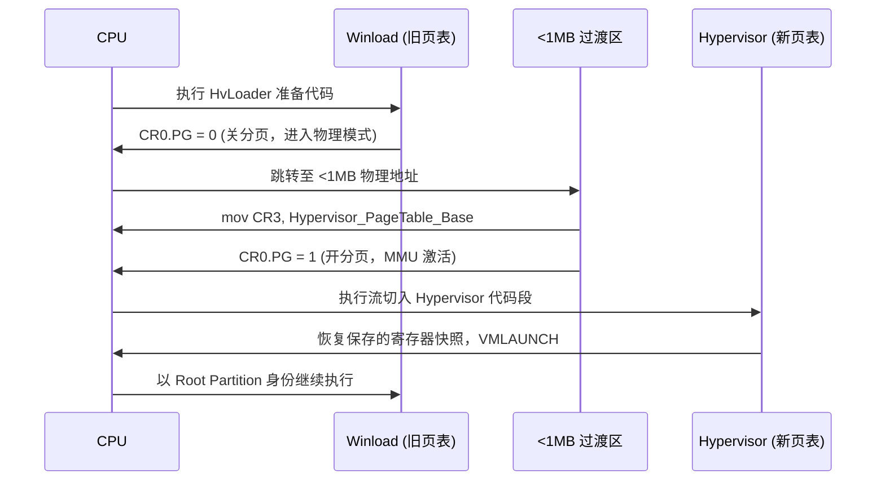

# Hyper-V Research 文章总结

## 文章主旨

这篇文章是一篇面向安全研究视角的 Hyper-V 入门与逆向分析笔记。作者从 Hyper-V 在 Windows 安全体系中的定位出发，串联了 Hyper-V、VBS、HVCI、VTL、Secure Kernel 与 hypercall 等关键概念，并结合 `winload.exe`、`hvloader.dll`、`securekernel.exe` 等组件的反汇编结果，说明 Hyper-V 是如何在系统启动阶段被装载、初始化并逐步接管更高权限执行环境的。

## 文章核心内容

### 1. Hyper-V 的基本定位

- Hyper-V 是微软的 Type 1 Hypervisor，运行权限高于传统内核，可视作 Ring -1 组件。
- 它不仅用于虚拟机能力，也构成了 Windows VBS（基于虚拟化的安全）体系的底座。
- HVCI 等强安全机制依赖 Hyper-V 才能生效，因此 Hyper-V 在现代 Windows 安全架构里不是“可选附属”，而是基础设施。

### 2. 启动链中的关键组件

文章重点解释了 Hyper-V 在启动链中的装载流程：

- `Hvloader.dll` 负责加载并启动 Hyper-V 与 Secure Kernel。
- `Hvloader.dll` 会根据 CPU 平台选择对应的 Hypervisor 映像：
  - Intel 使用 `Hvix64.exe`
  - AMD 使用 `Hvax64.exe`
  - ARM64 使用 `Hvaa64.exe`
- `Winload.exe` 中的逻辑会先准备 Hypervisor 相关数据结构，再完成向 Hypervisor 执行空间的切换。

作者强调，Hyper-V 的加载分为两个阶段：

- 第一阶段建立仅映射 Hypervisor 映像的页表层级。
- 第二阶段在 Winload 末期关闭部分启动环境，切换地址空间并把执行流转移到 Hypervisor。

其结果是：原本正在启动的 Windows 实例会被“转化”为运行在 Hypervisor 之上的虚拟化环境。

### 3. `CPUID` 在 Hyper-V 初始化中的作用

文章用较大篇幅说明 `CPUID` 在初始化期间的用途，核心包括：

- 检查 CPU 厂商字符串，例如 `GenuineIntel`。
- 检查处理器是否支持 VMX 等虚拟化功能。
- 检查 Hypervisor 是否存在，以及是否为 Microsoft 兼容实现。
- 获取 Hypervisor Feature 信息，为后续装载和功能启用做条件判断。

作者通过汇编和伪代码展示了 `CpuComp`、`VmxEnComp`、`HviGetHypervisorFeatures`、`HviIsHypervisorMicrosoftCompatible` 等函数，说明 Hyper-V 相关代码不会盲目运行，而是先验证底层处理器与虚拟化环境能力是否满足要求。

### 4. `winload.exe` 中的关键路径

作者从 `OslpMain()` 切入，指出其中最值得关注的是 `OslPrepareTarget()`。这条路径最终会走到 `OslArchHypervisorSetup()`，后者负责：

- 获取 Hypervisor 启动类型
- 加载 `HvLoader`
- 加载真正的 Hypervisor 映像
- 记录 Hypervisor 启动事件

这里最关键的函数包括：

- `OslGetHypervisorLaunchType()`：决定是否以及如何启动 Hypervisor。
- `HvlpLoadHvLoader()`：负责获取 `hvloader.dll` 并解析导出函数。
- `HvlpLoadHvLoaderDll()`：拼接路径、预加载或正式加载 `hvloader.dll`。
- `HvlpLoadHypervisor()`：进一步把 Hypervisor 主体映像装载到内存。

作者特别指出，`HvlpLoadHvLoader()` 会动态解析多个关键导出，例如：

- `HvlRescindVsm`
- `HvlLaunchHypervisor`
- `HvlLoadHypervisor`
- `HvlRegisterRuntimeRange`
- `HvlExchangeDispatchInterface`

这说明启动加载器和 Hypervisor 主体之间是通过一组运行期解析的接口协同工作的。

### 5. 分区（Partition）与拦截机制

文章随后从架构层面介绍 Hyper-V 的 Partition 模型：

- Root Partition：宿主分区，掌握更高控制权限。
- Child Partition：来宾分区，用于承载普通客户机操作系统。

作者强调一个重要观点：Child Partition 并不是完全自由执行的。遇到特定事件时，执行会被 VM Exit/Intercept 打断并交由上层处理。文章列举了大量 Intel VM Exit 原因，例如：

- `CPUID`
- `HLT`
- `VMCALL`
- `CR_ACCESS`
- `MSR_READ`
- `MSR_WRITE`
- `EPT_VIOLATION`

这部分的意义在于说明 Hyper-V 的控制能力并不只是“提供虚拟机”，而是通过精细的拦截与事件转发机制对来宾执行过程进行治理。

### 6. VTL 与系统信任分层

文章对 VTL（Virtual Trust Level）做了较清晰的说明：

- VTL Admin / `hvix64.sys`：由 Hypervisor 管理，拥有对内存、寄存器、EPT、上下文切换等最强控制权限。
- VTL 0：普通操作系统所在层级，典型代表是 `ntoskrnl.exe` 与常规驱动。
- VTL 1：由 `securekernel.exe` 驱动的安全内核层，用于承载 HVCI、Credential Guard 等安全能力。

重点在于：

- VTL 1 的地址空间与 VTL 0 隔离。
- 普通 Ring 0 代码不能直接访问 VTL 1。
- `hvix64.sys` 不作为普通驱动出现在常规驱动树中，因为它位于操作系统“之下”。

这也是 Windows 把关键安全机制从传统内核中“抽离”出来并放到更高信任层的基础逻辑。

### 7. `securekernel.exe` 的初始化流程

文章进一步进入 VTL 1，分析 `securekernel.exe` 的入口 `SkiSystemStartup()`。作者展示了该函数如何逐步完成：

- 时间戳计数器初始化
- CPU 特性位收集
- Hypervisor 交互能力初始化
- 内存管理初始化
- 安全服务表整理
- 最终启动 VTL 1 相关能力

其中作者重点分析了几个函数：

- `SkiInitializeSystemTsc()`：初始化 TSC 相关信息，决定时间基准。
- `SkiSetFeatureBits()`：借助 `CPUID` 收集 CPU 能力并设置 Secure Kernel 的功能位。
- `SkiGetProcessorSignature()` 与 `SkiGetCpuVendor()`：识别 CPU 厂商、系列和型号。
- `ShvlInitSystem()`：负责安全内核阶段初始化、VSM 能力查询以及 hypercall 支持的建立。

这部分说明 Secure Kernel 虽然体量精简，但它不是一个简单的附属模块，而是一个拥有独立初始化路径和执行环境的安全内核。

### 8. Hypercall 支持的建立

文章最后一块重点内容是 Hypercall 机制。作者通过 `ShvlpInitializeHypercallSupport()`、`ShvlpRegisterForHypercallSupport()`、`HvcallInitiateHypercall()` 等函数说明：

- Secure Kernel 会拿到 hypercall code page 的虚拟地址和物理地址。
- 初始化过程中会写入相关 MSR 以启用 Hypercall 支持。
- Hypercall 最终通过函数指针 `HvcallCodeVa` 进入 Hypervisor 提供的调用页。

作者还给出一个例子：`ShvlNotifyLongSpinWait()` 最终调用 `HvcallInitiateHypercall(0x10008, a1, 0)`，说明 Secure Kernel 与 Hypervisor 之间的交互是通过这种受控接口完成的。

## 文章的研究价值

从研究角度看，这篇文章的价值主要体现在以下几点：

- 它不是只讲概念，而是把概念与真实二进制中的函数路径对应起来。
- 它把 Hyper-V、VBS、Secure Kernel、VTL 等常见术语放回到系统启动与初始化语境里，便于建立整体理解。
- 它给出了后续漏洞研究的切入点，例如：启动阶段、Hypervisor 装载逻辑、VTL 边界、Hypercall 接口、拦截机制。

## 一句话结论

这篇文章的核心观点是：Hyper-V 并不只是 Windows 的虚拟机功能模块，而是现代 Windows 安全架构的底层执行基座；理解它的启动链、分区模型、VTL 隔离与 Hypercall 机制，是进一步研究 VBS、HVCI、Secure Kernel 乃至 Hyper-V 漏洞利用的前提。

# 人工补充

1、hyper在开机的时候是如何和winload进行交互的。

2、交互的流程图

```mermaid
graph TD
    %% 定义样式
    classDef uefi fill:#fff3e0,stroke:#e65100,stroke-width:2px;
    classDef hv_load fill:#e3f2fd,stroke:#1565c0,stroke-width:2px;
    classDef mem_map fill:#e8eaf6,stroke:#283593,stroke-width:3px,font-weight:bold;
    classDef phase1 fill:#e0f2f1,stroke:#00695c,stroke-width:2px;
    classDef phase2 fill:#fce4ec,stroke:#c2185b,stroke-width:2px;
    classDef transition fill:#fff9c4,stroke:#fbc02d,stroke-width:2px,stroke-dasharray: 5 5;
    classDef hypervisor fill:#ede7f6,stroke:#4527a0,stroke-width:3px;
    classDef win_os fill:#e8f5e9,stroke:#2e7d32,stroke-width:2px;

    subgraph UEFI_Boot [UEFI 引导阶段]
        Start((系统冷启动)) --> UEFI_Winload[Winload.efi 执行]
        UEFI_Winload --> Detect[调用 HvLoader 检测目标平台]
    end

    subgraph HvLoader_Check [HvLoader 兼容性检测]
        Detect --> CPUID{执行 CPUID 指令}
        CPUID -- 不兼容 --> Skip[跳过虚拟化 -> 标准裸机启动]
        CPUID -- 兼容 --> CopyMemMap["📋 复制 UEFI 物理内存映射表"]
        CopyMemMap --> LoadPE[加载 Hypervisor 镜像 PE 文件]
        LoadPE --> Verify[校验镜像完整性与结构]
    end

    subgraph Phase1 [第一阶段：构建最小化环境]
        Verify --> BuildPT[构建 Hypervisor 专属页表层级]
        BuildPT --> MapImg[仅映射 Hypervisor 镜像本身]
    end

    subgraph Phase2 [第二阶段：状态冻结与转移准备]
        MapImg --> DiscardUEFI[丢弃 UEFI Boot Services]
        DiscardUEFI --> CopyRuntime[复制 UEFI Runtime Services 物理地址]
        CopyRuntime --> CaptureState[捕获当前处理器完整状态]
        CaptureState --> Disable[关闭中断、调试器、分页 CR0.PG=0]
        Disable --> JumpFunc[调用 HvlpTransferToHypervisorViaTransitionSpace]
    end

    subgraph Transition [过渡空间：1MB 以下区域]
        JumpFunc --> Jump1MB[跳转至 1MB 以下安全物理内存]
        Jump1MB --> UpdateCR3[加载 Hypervisor 页表基址到 CR3]
        UpdateCR3 --> EnablePaging[重新开启分页机制]
        EnablePaging --> SwitchExec[切换执行流至 Hypervisor 代码段]
    end

    subgraph Hypervisor_Core [Hypervisor 接管：Root Mode]
        SwitchExec --> HV_Start[Hypervisor 微内核启动]
        HV_Start --> SpaceSep[创建隔离地址空间]
        SpaceSep --> RestoreContext[使用保存的处理器状态快照]
        RestoreContext --> VM_Launch[调整 VMCS/VMCB 后执行 VMLAUNCH]
    end

    subgraph Windows_OS [Windows 运行：Root Partition]
        VM_Launch --> WinResume[Winload 恢复执行]
        WinResume --> WinBoot[Windows 内核继续加载]
        WinBoot --> FinalState[Windows 以根分区虚拟机身份运行]
    end

    %% 流程连接
    UEFI_Boot --> HvLoader_Check
    HvLoader_Check --> Phase1
    Phase1 --> Phase2
    Phase2 --> Transition
    Transition --> Hypervisor_Core
    Hypervisor_Core --> Windows_OS

    %% 样式应用
    class Start,UEFI_Winload,UEFI_Winload uefi;
    class Detect,CPUID,LoadPE,Verify hv_load;
    class CopyMemMap mem_map;
    class BuildPT,MapImg phase1;
    class DiscardUEFI,CopyRuntime,CaptureState,Disable,JumpFunc phase2;
    class Jump1MB,UpdateCR3,EnablePaging,SwitchExec transition;
    class HV_Start,SpaceSep,RestoreContext,VM_Launch hypervisor;
    class WinResume,WinBoot,FinalState win_os;
```

